# 帝纪第一

# 宣帝

`宣皇帝`讳`懿`，字`仲达`，`河内`[1] `温县`[2] `孝敬里`人，姓`司马氏`。其先出自帝`高阳`[3]之子`重黎`[4]，为夏官祝融，历`唐`、`虞`、`夏`、`商`，世序其职。及`周`，以夏官为司马。其后`程柏休父`，`周宣王`时，以世官克平`徐方`[5]，锡以官族，因而为氏。`楚` `汉`间，`司马卬`为`赵`将，与诸侯伐`秦`。`秦`亡，立为`殷王`，都`河内`。`汉`以其地为郡，子孙遂家焉。自`卬`八世，生征西将军`钧`，字`叔平`。`钧`生`豫章`太守`量`，字`公度`。`量`生`颍川`[6]太守`俊`，字`元异`。`俊`生`京兆`尹`防`，字`建公`。帝即`防`之第二子也。少有奇节，聪明多大略，博学洽闻，伏膺儒教。`汉`末大乱，常慨然有忧天下心。`南阳`[7]太守同郡`杨俊`名知人，见帝，未弱冠，以为非常之器。尚书`清河` `崔琰`与帝兄`朗`善，亦谓`朗`曰：“君弟聪亮明允，刚断英特，非子所及也。”

>**[1] 河内**：[河内]()，是中国古代地区名，有广义狭义之分。广义泛指黄河中游北面的地区，约相当于今豫北地区。狭义则专指河内郡（今沁阳）。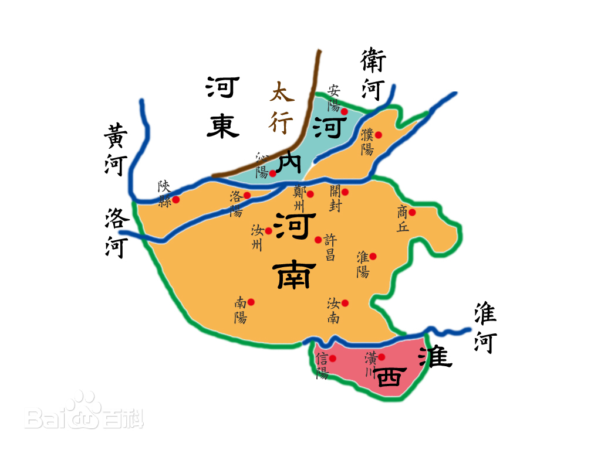

>**[2] 温县**：今天隶属于河南省焦作市。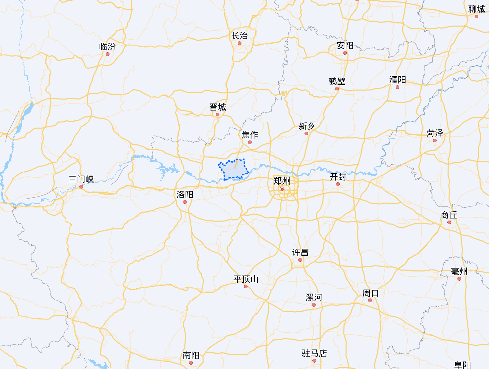

>**[3] 高阳**：[颛顼](https://baike.baidu.com/item/颛顼/7226038?fromtitle=高阳&fromid=3579120#viewPageContent)（zhuān xū），姬姓，高阳氏，黄帝之孙，昌意之子。出生于若水（现四川省雅安市荥经县地区六合乡附近）。上古部落联盟首领，“五帝”之一，人文始祖之一。

>**[4] 重黎**：[重黎](https://baike.baidu.com/item/重黎/3483531)，风姓，为羲、和二氏之祖先。重黎亦作“重蔾”。是颛顼高阳氏之后，即颛顼族祝融氏，为帝喾高辛氏火正。

>**[5] 徐方**：指古徐国。[徐方](https://baike.baidu.com/item/徐方/19863463?fromModule=lemma_sense-layer#viewPageContent)，即徐国。古称淮夷为徐，居住在淮河流域。

>**[6] 颍川**：[颍川](https://baike.baidu.com/item/颍川/10913063?fromModule=disambiguation)，古代郡名，秦王嬴政17年（公元前230年）置。以颍水得名，治所在阳翟（今河南省禹州市）。

>**[7] 南阳**：[南阳郡](https://baike.baidu.com/item/南阳郡/7962245)是设立于秦昭王三十五年（公元前272年）的郡级政区，为秦国夺取楚国之地而设，治所在宛县（今河南省南阳）。西汉时期，王莽受封南阳新都（今新野东南），汉更始皇帝于南阳登基，定都长安。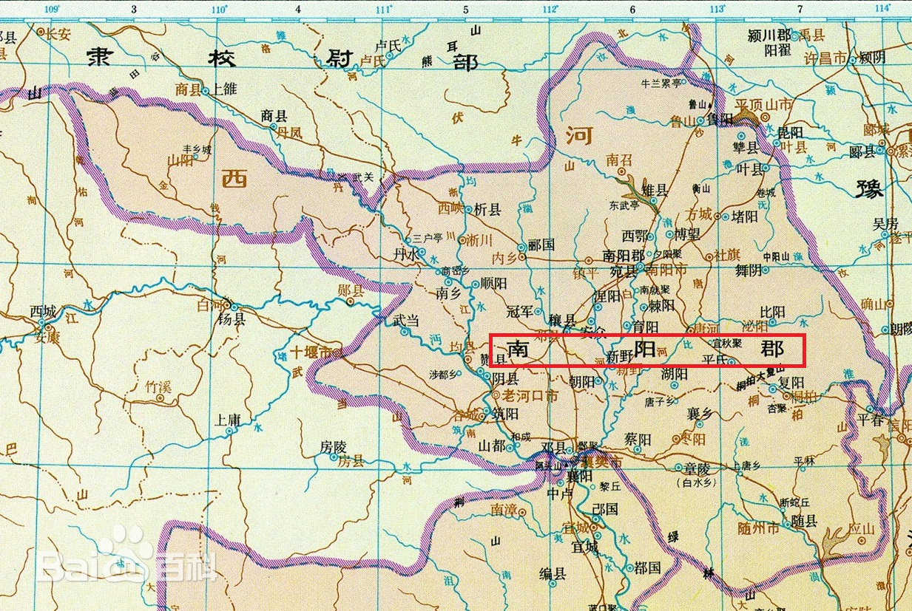

`汉` `建安`[8]六年，郡举上计掾。`魏武帝`为司空，闻而辟之。帝知`汉`运方微，不欲屈节`曹氏`，辞以风痹，不能起居。`魏武`使人夜往密刺之，帝坚卧不动。及`魏武`为丞相，又辟为文学掾，敕行者曰：“若复盘桓，便收之。”帝惧而就职。于是，使与太子游处，迁黄门侍郎，转议郎、丞相东曹属，寻转主簿。

>**[8] 建安**：[建安](https://baike.baidu.com/item/建安/8722)，是东汉末年汉献帝的年号，使用时间从公元196年1月至公元220年3月。这个时期的东汉朝廷的政治大权主要由曹操所掌握。

从讨`张鲁`，言于`魏武`曰：“`刘备`以诈力虏`刘璋`，`蜀`人未附而远争`江陵`[9]，此机不可失也。今若曜威`汉中`[10]，`益州`[11]震动，进兵临之，势必瓦解。因此之势，易为功力。圣人不能违时，亦不失时矣。”`魏武`曰：“人苦无足，既得`陇`右，复欲得`蜀`！”言竟不从。既而从讨`孙权`，破之。军还，`权`遣使乞降，上表称臣，陈说天命。`魏武帝`曰：“此儿欲踞吾著炉炭上邪！”答曰：“`汉`运垂终，殿下十分天下而有其九，以服事之。`权`之称臣，天人之意也。`虞`、`夏`、`殷`、`周`不以谦让者，畏天知命也。”

>**[9] 江陵**：[荆州市](https://baike.baidu.com/item/荆州市/62402558?fromtitle=江陵&fromid=4726)，古称江陵、郢都、南郡，湖北省辖地级市。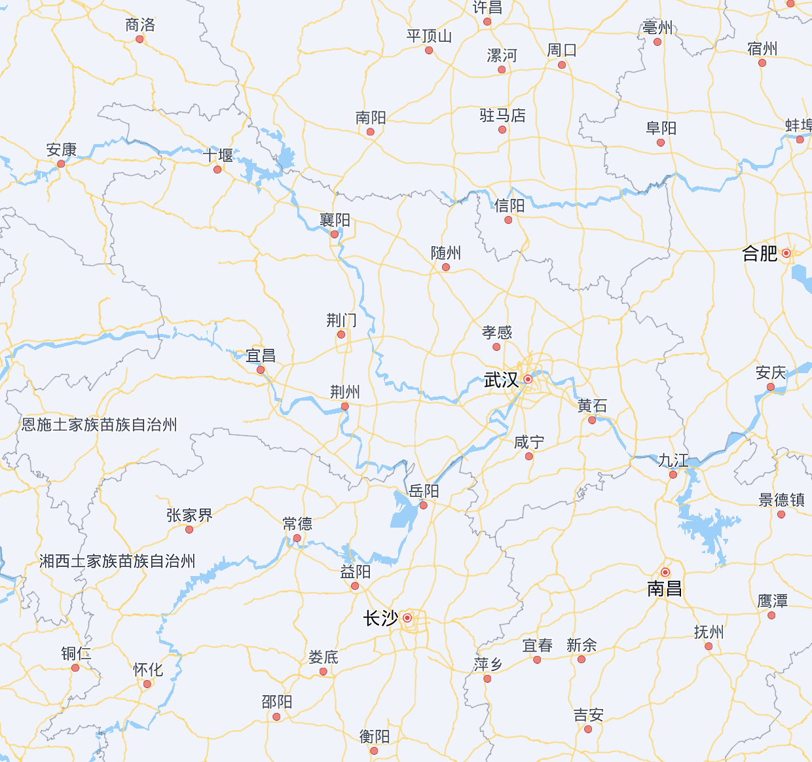

>**[10] 汉中**：三国时期，有三座城最为重要，是兵家必争之地。[汉中](https://baike.baidu.com/tashuo/browse/content?id=013e9d86630c92966d2a1a53&lemmaId=2453961&fromLemmaModule=pcRight&lemmaTitle=汉中市&fromModule=lemma_right-tashuo-article)被称为“益州咽喉”，是蜀地的门户，如果失去汉中，魏军可以长驱直入到成都平原，蜀汉将无险可守，面临亡国的危险。张鲁的存在，严重威胁了刘璋的统治，也隔绝了益州与西凉的联系。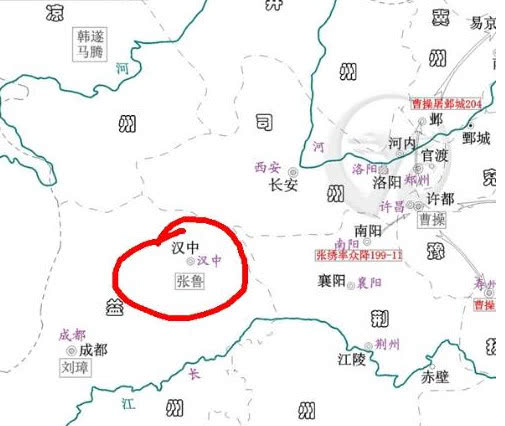

>**[11] 益州**：[益州](https://baike.baidu.com/item/益州/65621?structureClickId=65621&structureId=f1121e7fca772bfa91961b56&structureItemId=c852d19858fd70a2e4160625&lemmaFrom=starMapContent_star&fromModule=starMap_content&lemmaIdFrom=65621)，中国古地名，汉武帝设置的十三州（十三刺史部）之一，其最大范围（三国时期）包含今四川，重庆，云南，贵州，汉中大部分地区及缅甸北部，湖北、河南小部分，治所在蜀郡的成都。

`魏国`既建，迁太子中庶子。每与大谋，辄有奇策，为太子所信重，与`陈群`、`吴质`、`朱铄`号曰四友。

迁为军司马，言于`魏武`曰：“昔`箕子`陈谋，以食为首。今天下不耕者盖二十余万，非经国远筹也。虽戎甲未卷，自宜且耕且守。”`魏武`纳之，于是务农积谷，国用丰赡。帝又言`荆州`刺史`胡修`粗暴，`南乡`[12]太守`傅方`骄奢，并不可居边。`魏武`不之察。及`蜀`将`关羽`围`曹仁`于`樊`[13]，`于禁`等七军皆没，`修`、`方`果降`羽`，而`仁`围甚急焉。

>**[12] 南乡**：[南乡郡](https://baike.baidu.com/item/南乡郡?fromModule=lemma_search-box)是中国古代行政区划名。王莽新朝末（23年），析人邓晔起兵南乡以应汉。东汉始置南乡县，属南阳郡。建安十三年（208年），曹操夺荆州，分南阳郡西部设置南乡郡。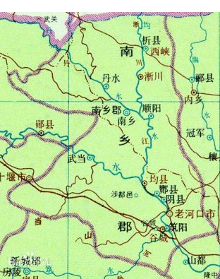

>**[13] 樊**：春秋战国时期，秦王政二十六年（前221年），秦统一诸国后置郡设县，[樊城](https://baike.baidu.com/item/樊城区/10785967?fromtitle=樊城&fromid=8067674)隶属南阳郡。东汉建安十三年（208年），曹操取樊，置襄阳郡，樊城隶属襄阳郡。今属湖北省襄阳市。

是时`汉帝`都`许昌`，`魏武`以为近贼，欲徙`河`北。帝谏曰：“`禁`等为水所没，非战守之所失，于国家大计未有所损，而便迁都，既示敌以弱，又`淮` `沔`之人大不安矣。`孙权`、`刘备`，外亲内疏，`羽`之得意，`权`所不愿也。可喻`权`所，令掎其后，则`樊`围自解。”`魏武`从之。`权`果遣将`吕蒙`西袭`公安`[14]，拔之，`羽`遂为`蒙`所获。

>**[14] 公安**：[公安县](https://baike.baidu.com/item/公安县/879207?fromtitle=公安&fromid=8258265#viewPageContent)，隶属湖北省荆州市，位于湖北省中南部。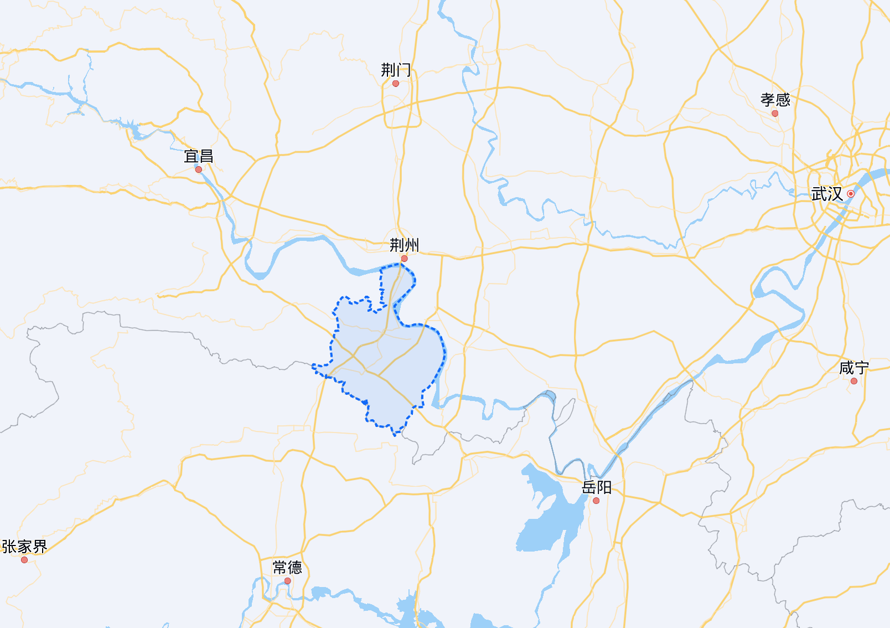 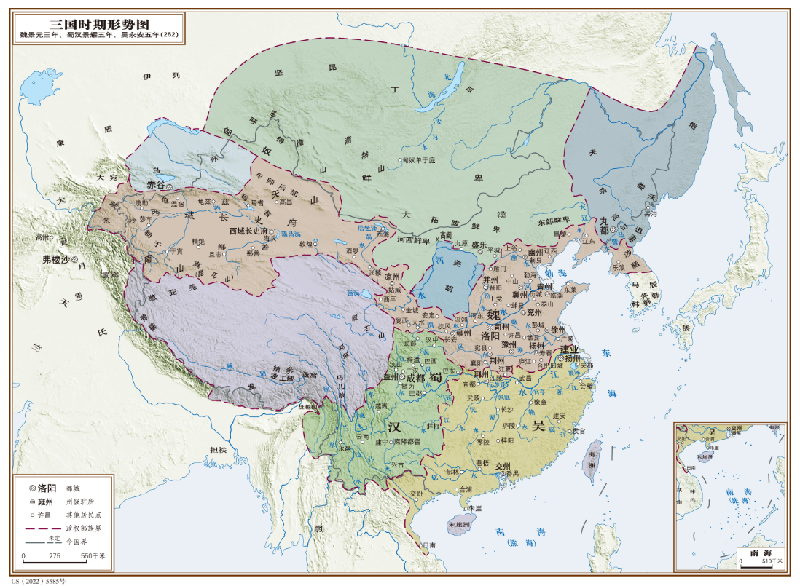

`魏武`以`荆州`遗黎及屯田在`颍川`者逼近南寇，皆欲徙之。帝曰：“`荆` `楚`轻脱，易动难安。`关羽`新破，诸为恶者藏窜观望。今徙其善者，既伤其意，将令去者不敢复还。”从之。其后诸亡者悉复业。

及`魏武`薨于`洛阳`，朝野危惧。帝纲纪丧事，内外肃然。乃奉梓宫还`邺`[15]。

>**[15] 邺**：[邺城](https://baike.baidu.com/item/邺城遗址/8409250?fromtitle=邺&fromid=20105106)遗址，其主体位于今河北省临漳县，是曹魏、后赵、冉魏、前燕、东魏、北齐都城遗址。为中国古代都城规划肇始地，在中国古代都城建设史上具有承上启下的重要意义。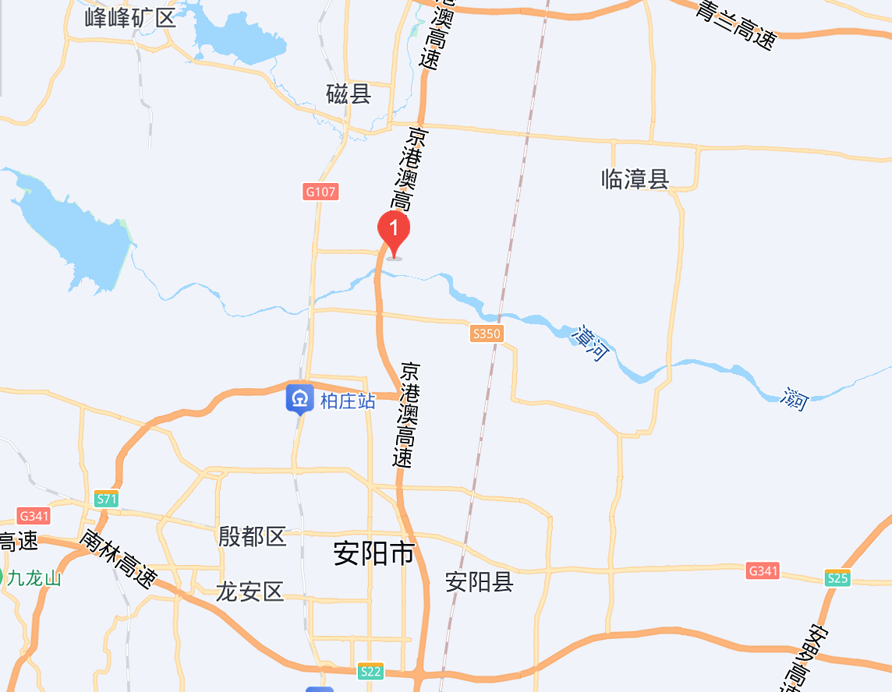

`魏文帝`即位，封`河津亭侯`，转丞相长史。会`孙权`帅兵西过，朝议以`樊`、`襄阳`无谷，不可以御寇。时`曹仁`镇`襄阳`，请召`仁`还`宛`。帝曰：“`孙权`新破`关羽`，此其欲自结之时也，必不敢为患。`襄阳`水陆之冲，御寇要害，不可弃也。”言竟不从。`仁`遂焚弃二城，`权`果不为寇，`魏文`悔之。

及`魏`受`汉`禅，以帝为尚书。顷之，转督军、御史中丞，封`安国乡侯`。

`黄初`[16]二年，督军官罢，迁侍中、尚书右仆射。

>**[16] 黄初**：[黄初](https://baike.baidu.com/item/黄初/10789105)（220年十月-226年），是三国时期曹魏的君主魏文帝曹丕的年号，共计7年。这是魏朝的第一个年号。黄初七年五月魏明帝曹叡即位沿用。第二年才改元。

五年，天子南巡，观兵`吴`疆。帝留镇`许昌`，改封`向乡侯`，转抚军、假节，领兵五千，加给事中、录尚书事。帝固辞。天子曰：“吾于庶事，以夜继昼，无须臾宁息。此非以为荣，乃分忧耳。”

六年，天子复大兴舟师征`吴`，复命帝居守，内镇百姓，外供军资。临行，诏曰：“吾深以后事为念，故以委卿。`曹参`虽有战功，而`萧何`为重。使吾无西顾之忧，不亦可乎！”天子自`广陵`[17]还`洛阳`，诏帝曰：“吾东，抚军当总西事；吾西，抚军当总东事。”于是帝留镇`许昌`。

>**[17] 广陵**：[广陵区](https://baike.baidu.com/item/广陵区/718254?fromtitle=广陵&fromid=81405)，隶属江苏省扬州市，地处江苏省中部。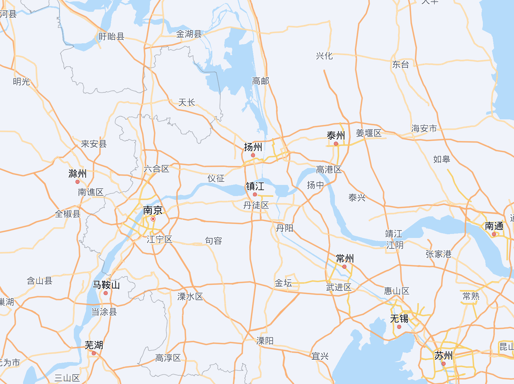

及天子疾笃，帝与`曹真`、`陈群`等见于`崇华殿`之南堂，并受顾命辅政。诏太子曰：“有间此三公者，慎勿疑之。”

`明帝`即位，改封`舞阳侯`。及`孙权`围`江夏`，遣其将`诸葛瑾`、`张霸`并攻`襄阳`，帝督诸军讨`权`，走之。进击，败`瑾`，斩`霸`，并首级千余。迁骠骑将军。

`太和`元年六月，天子诏帝屯于`宛`，加督`荆`、`豫`二州诸军事。

>**太和**：[太和](https://baike.baidu.com/item/太和/14903189?fromModule=lemma_sense-layer#viewPageContent)，中国及周边国家古代史上的帝王年号。使用该年号的帝王包括三国时期魏明帝曹叡（227-233年使用），十六国后赵石勒（328-330年使用）、成汉后主李势（344-346年使用），东晋废帝司马奕（366-371年使用），南北朝时期北魏孝文帝拓跋宏（477-499年使用），新罗真德王（647-650年使用），唐文宗李昂（827年-835年使用），越南后黎朝黎邦基（1443-1453年使用）等等。

初，`蜀`将`孟达`之降也，`魏朝`遇之甚厚。帝以`达`言行倾巧，不可任，骤谏，不见听，乃以`达`领`新城`太守，封侯，假节。`达`于是连`吴`固`蜀`，潜图中国。`蜀`相`诸葛亮`恶其反覆，又虑其为患。`达`与`魏兴`[18]太守`申仪`有隙，`亮`欲促其事，乃遣`郭模`诈降，过`仪`，因漏泄其谋。`达`闻其谋漏泄，将举兵。帝恐`达`速发，以书喻之曰：“将军昔弃`刘备`，托身国家，国家委将军以疆场之任，任将军以图`蜀`之事，可谓心贯白日。`蜀`人愚智，莫不切齿于将军。`诸葛亮`欲相破，惟苦无路耳。`模`之所言，非小事也，`亮`岂轻之而令宣露，此殆易知耳。”`达`得书大喜，犹与不决。帝乃潜军进讨。诸将言`达`与二贼交构，宜观望而后动。帝曰：“`达`无信义，此其相疑之时也，当及其未定促决之。”乃倍道兼行，八日到其城下。`吴` `蜀`各遣其将向`西城` `安桥`、`木阑塞`以救`达`，帝分诸将距之。

>**[18] 魏兴**：[魏兴郡](https://baike.baidu.com/item/魏兴郡?fromModule=lemma_search-box)，三国曹魏置。魏黄初二年（公元221年），曹丕取“曹魏兴盛”之意，改西城郡置，属荆州。相当今陕西省安康市；湖北郧县、郧西二县地。应该在郧县这个地方，见[12]。

初，`达`与`亮`书曰：“`宛`去`洛`八百里，去吾一千二百里，闻吾举事，当表上天子，比相反覆，一月间也，则吾城已固，诸军足办。则吾所在深险，`司马公`必不自来；诸将来，吾无患矣。”及兵到，`达`又告`亮`曰：“吾举事，八日而兵至城下，何其神速也！”`上庸`城[19]三面阻水，`达`于城外为木栅以自固。帝渡水，破其栅，直造城下。八道攻之，旬有六日，`达`甥`邓贤`、将`李辅`等开门出降。斩`达`，传首京师。俘获万余人，振旅还于`宛`。乃劝农桑，禁浮费，南土悦附焉。

>**[19] 上庸**：[上庸](https://baike.baidu.com/item/上庸?fromModule=lemma_search-box)为古代地名。汉末至南朝梁有上庸郡，治上庸，在今湖北竹山县西南。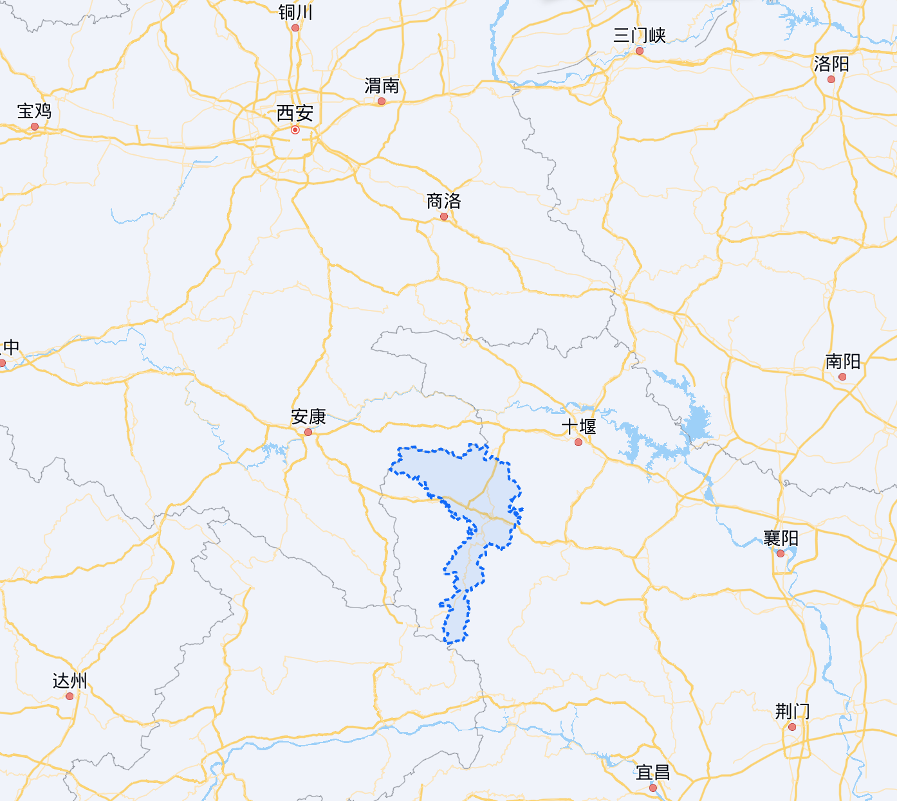

初，`申仪`久在`魏兴`，专威疆场，辄承制刻印，多所假授。`达`既诛，有自疑心。时诸郡守以帝新克捷，奉礼求贺，皆听之。帝使人讽`仪`，`仪`至，问承制状，执之，归于京师。又徙`孟达`余众七千余家于`幽州`。`蜀`将`姚静`、`郑他`等帅其属七千余人来降。

时边郡新附，多无户名，`魏朝`欲加隐实。属帝朝于京师，天子访之于帝。帝对曰：“贼以密网束下，故下弃之。宜弘以大纲，则自然安乐。”又问二虏宜讨，何者为先？对曰：“`吴`以中国不习水战，故敢散居`东关`[20]。凡攻敌，必扼其喉而摏其心。`夏口`、`东关`，贼之心喉。若为陆军以向`皖`城，引`权`东下，为水战军向`夏口`，乘其虚而击之，此神兵从天而堕，破之必矣。”天子并然之，复命屯于`宛`。

>**[20] 东关**：[东关](https://baike.baidu.com/item/东关/7353047)，故址在今安徽省马鞍山含山县西南濡须山上。三国吴诸葛恪筑，隔濡须水与七宝山上的西关相对。北控巢湖，南扼长江，为吴、魏间的要冲。南北朝时仍为军事重地。也要参考词条[濡须坞](https://baike.baidu.com/item/濡须坞/4824511?fromModule=lemma_inlink)。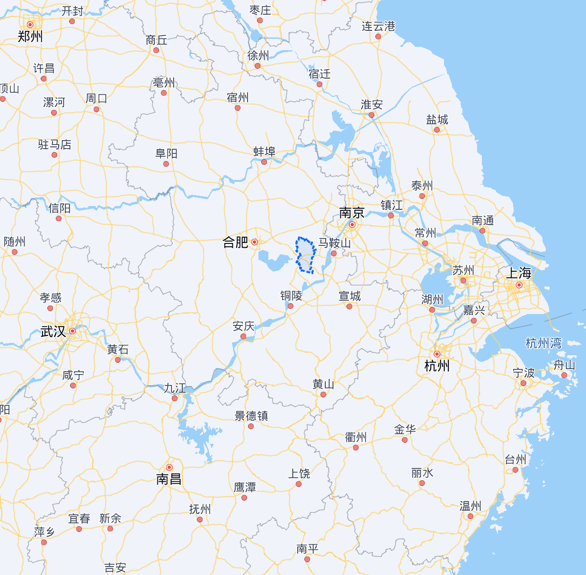

四年，迁大将军，加大都督、假黄钺，与`曹真`伐`蜀`。帝自`西城`斫山开道，水陆并进，溯`沔`[21]而上，至于`朐䏰`[22]，拔其`新丰县`。军次`丹口`，遇雨，班师。

>**[21] 沔**：古时的[汉水](https://baike.baidu.com/item/沔水/12802814?fr=aladdin)，指的现今的嘉陵江西源西汉水，“嶓冢导漾，东流为汉”、“维天有汉”指的是古汉水。古水名，即长江第一大支流汉江，发源于秦岭南麓。流经沔县（现勉县）故称沔水，东流至汉中始称汉江（有别于古汉水）；自安康至丹江口段古称沧浪水，襄阳以下别名襄江、襄水。汉江流经陕西、湖北两省，在武汉市汉口龙王庙汇入长江。河长1577千米，流域面积1959年前为17.43万平方千米，位居长江水系各流域之首；1959年后，减少至15.9万平方千米。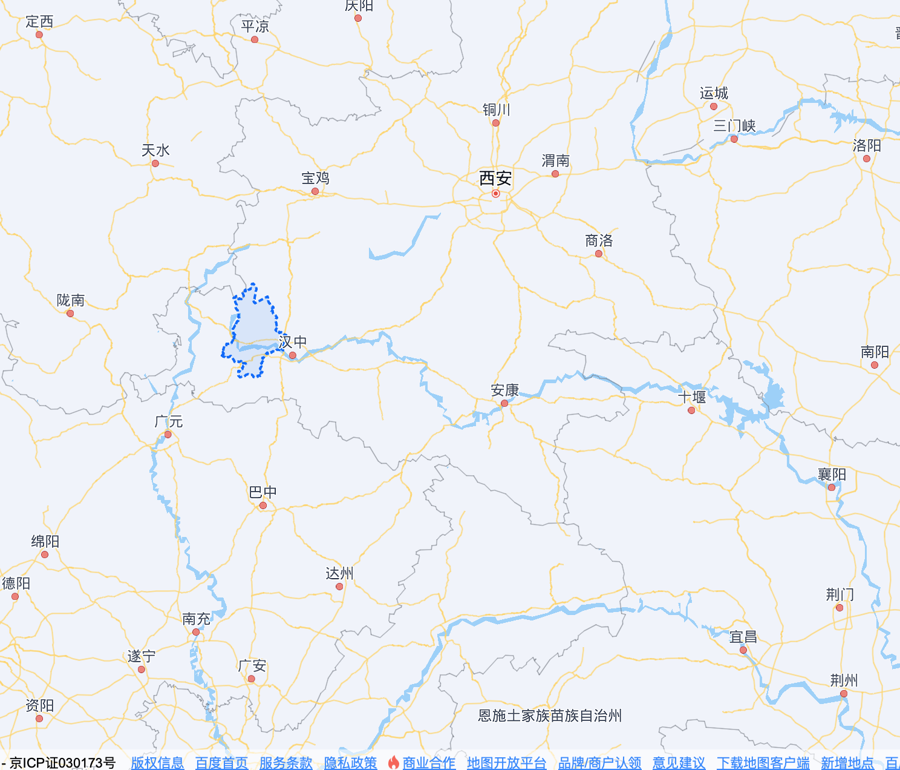 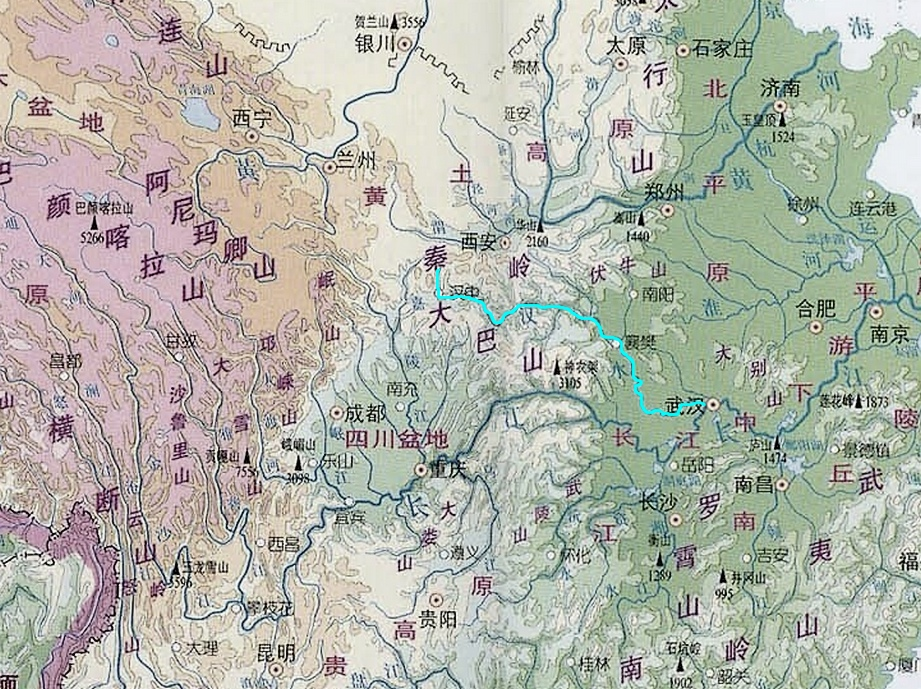 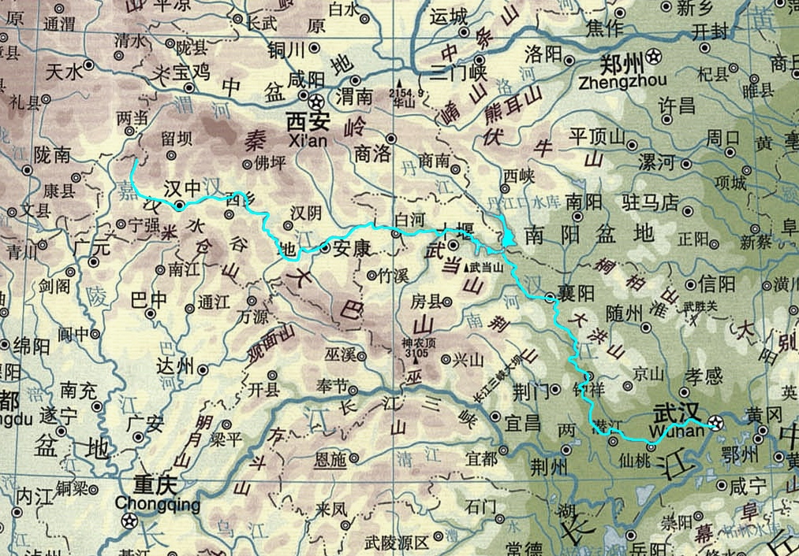

>**[22] 朐䏰(chǔn rěn)**：[朐䏰](https://baike.baidu.com/item/朐䏰?fromModule=lemma_search-box)，古代县名，东周赧王元年（前314年）始置，历经秦汉魏晋，北周天和三年（568年）县治迁汤口（今云阳县云阳镇），更县名“云安”。朐䏰县治在今重庆市云阳县双江镇建民村（原名万户驿、万户坝、旧县坪），辖今之重庆市云阳县、开县、万州、梁平县等地域。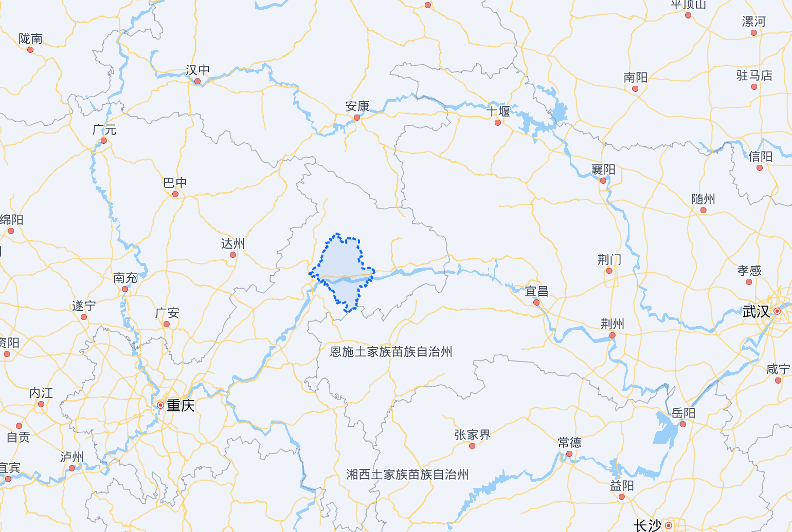

明年，`诸葛亮`寇`天水`[23]，围将军`贾嗣`、`魏平`于`祁山`[24]。天子曰：“西方有事，非君莫可付者。”乃使帝西屯`长安`，都督`雍`、`凉`二州诸军事，统车骑将军`张郃`、后将军`费曜`、征`蜀`护军`戴凌`、`雍州`刺史`郭淮`等讨`亮`。`张郃`劝帝分军往`雍`、`郿`[25]为后镇，帝曰：“料前军独能当之者，将军言是也。若不能当，而分为前后，此`楚`之三军所以为`黥布`禽也。”遂进军`隃麋`[26]。`亮`闻大军且至，乃自帅众将芟`上邽`[27]之麦。诸将皆惧，帝曰：“`亮`虑多决少，必安营自固，然后芟麦。吾得二日兼行足矣。”于是卷甲晨夜赴之。`亮`望尘而遁。帝曰：“吾倍道疲劳，此晓兵者之所贪也。`亮`不敢据`渭水`[28]，此易与耳。”进次`汉阳`，与`亮`相遇，帝列阵以待之。使将`牛金`轻骑饵之，兵才接而`亮`退，追至`祁山`。`亮`屯`卤城`[29]，据南北二山，断水为重围。帝攻拔其围，`亮`宵遁。追击，破之，俘斩万计。天子使使者劳军，增封邑。

>**[23] 天水**：主要指天水郡，如图所示。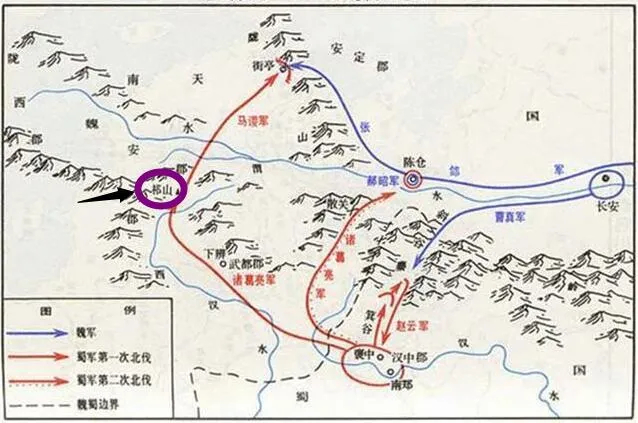

>**[24] 祁山**：[祁山](https://baike.baidu.com/item/祁山/7995242)位于甘肃礼县东、西汉水北侧，西起北岈（今平泉大堡子山），东至卤城（今盐官镇），绵延约50华里，海拔237米，是礼县诸山的最高峰。详情参考词条：[诸葛亮六出祁山：兵家必争之地的祁山，有多重要](https://baike.baidu.com/tashuo/browse/content?id=67972810bbac941d5963cb35&lemmaId=7995242&fromLemmaModule=pcRight&lemmaTitle=祁山&fromModule=lemma_right-tashuo-article)。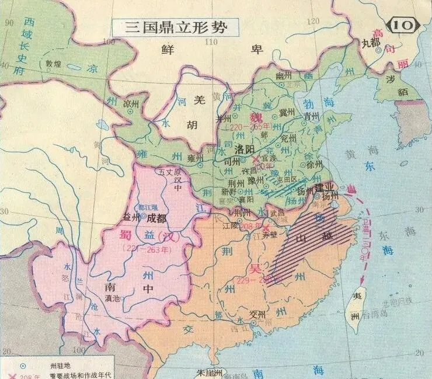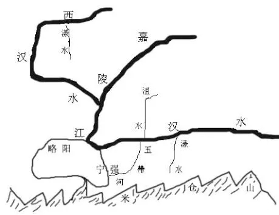

>**[25] 郿**：[眉县](https://baike.baidu.com/item/眉县/725878?fromtitle=郿县&fromid=5586932&fromModule=lemma_search-box)，隶属于陕西省宝鸡市，古称“眉坞”，位于秦岭主峰太白山脚下，北跨渭河。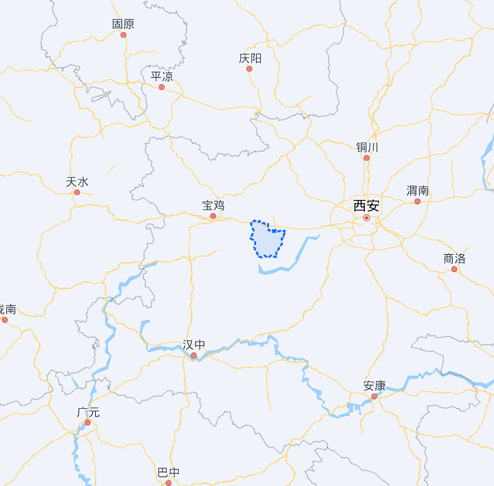

>**[26] 隃麋**：[隃麋](https://baike.baidu.com/item/隃麋?fromModule=lemma_search-box)，读音为yú mí，汉语词语，意思是墨的古称。墨的古称。最早的墨，以隃麋（今陕西千阳）所制为贵，故名“隃麋墨”。东汉时，隃麋地区有大片松林，盛行烧烟制墨，墨的质量很好。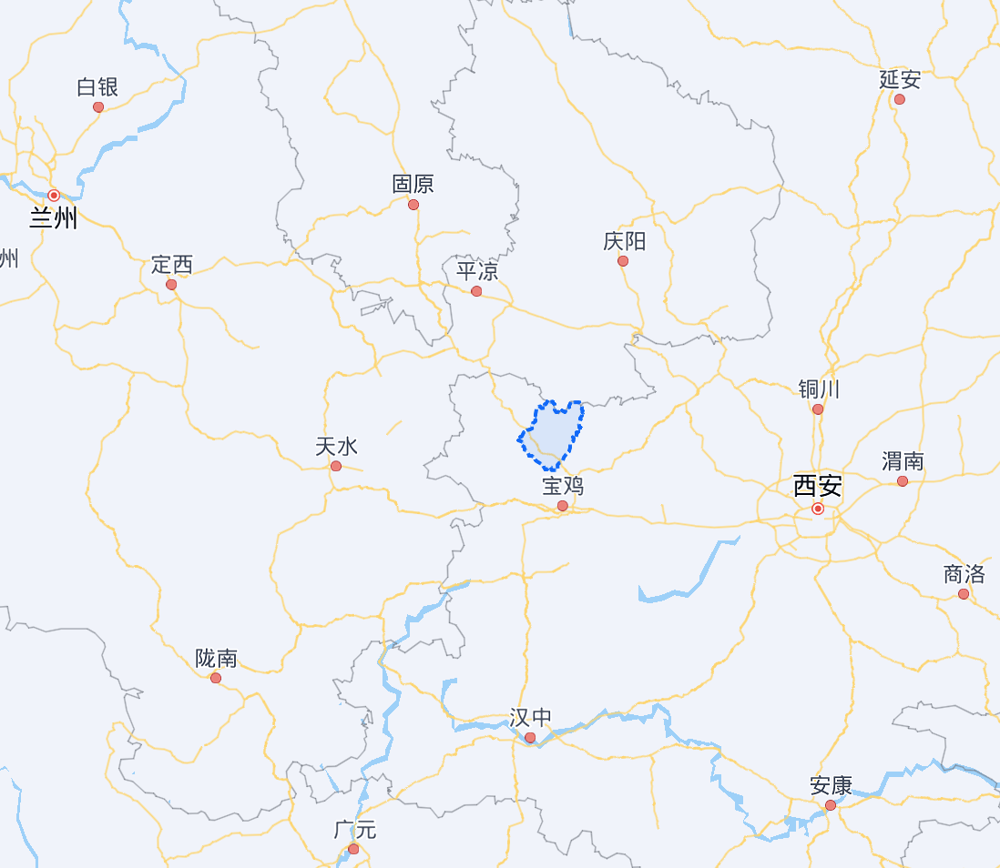

>**[27] 上邽**：[上邽](https://baike.baidu.com/item/上邽?fromModule=lemma_search-box)[guī]，又称邽县，以“清泉四注”而得县名，秦武公十年伐邽初县之。即邽戎邑，属天水郡。（位于今甘肃省天水市清水县）。邽县后改称上邽县，于（前687年），迁徙部分邽戎移民于今陕西咸阳以东、渭水北岸，再设邽县，此即下邽，与前设邽县东西上下遥相对应，原设的天水邽戎地之邽县遂称为上邽。

>**[28] 渭水**：[渭河](https://baike.baidu.com/item/渭河/932174?fromtitle=渭水&fromid=4827164&fromModule=lemma_search-box)，古称渭水，是黄河的最大支流，地处中国西北黄土高原东南部。发源于甘肃省定西市渭源县鸟鼠山，横跨甘肃东部和陕西中部，主要流经今甘肃天水、陕西省关中平原的宝鸡、咸阳、西安、渭南等地，至渭南市潼关县汇入黄河。干流全长818公里，流域总面积134766平方公里。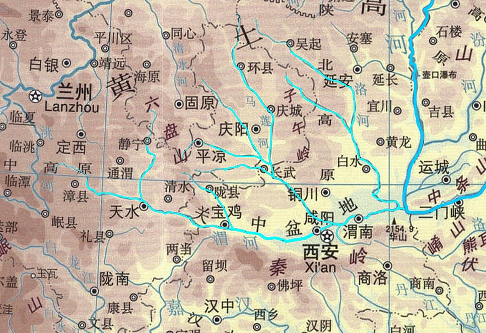

>**[29] 卤城**：[卤城之战](https://baike.baidu.com/item/卤城之战/14897090?fromModule=search-result_lemma)，是诸葛亮第四次北伐祁山，蜀军和魏军在卤城发生的战役，发生于231年2月。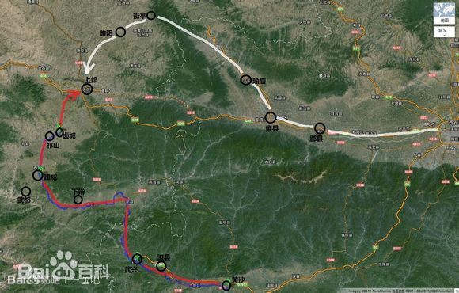

时军师`杜袭`、督军`薛悌`皆言，明年麦熟，`亮`必为寇，`陇`右[30]无谷，宜及冬豫运。帝曰：“`亮`再出`祁山`，一攻`陈仓`[31]，挫衄而反。纵其后出，不复攻城，当求野战，必在`陇`东，不在西也。`亮`每以粮少为恨，归必积谷，以吾料之，非三稔不能动矣。”于是表徙`冀州`农夫佃`上邽`，兴`京兆`、`天水`、`南安`监冶。

>**[30] 陇右**：[陇右](https://baike.baidu.com/item/陇右?fromModule=lemma_search-box)，又称“陇西”，泛指陇山以西地区。古人以“东为左，西为右”，故名。狭义的陇右，指今甘肃省黄河以东、陇山以西的地区，包括甘肃省兰州市、定西市、天水市、平凉市、庆阳市。请参考词条：[关中还是陇右，诸葛亮北伐的目标是哪里？](https://baike.baidu.com/tashuo/browse/content?id=15c17d144934580ca9410f25&lemmaId=10471317&fromLemmaModule=pcRight&lemmaTitle=陇右&fromModule=lemma_right-tashuo-article)。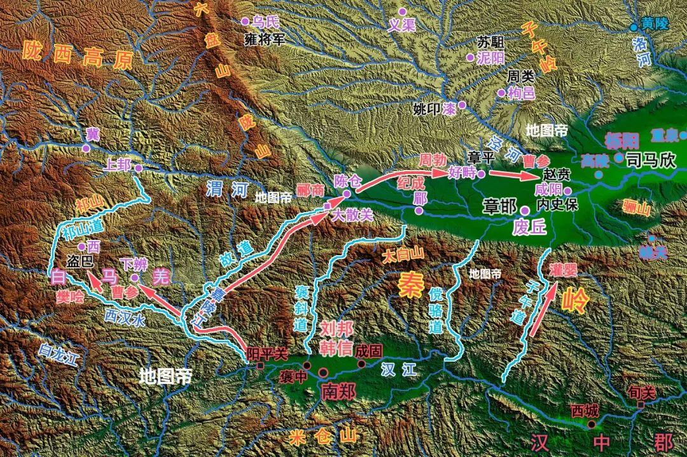 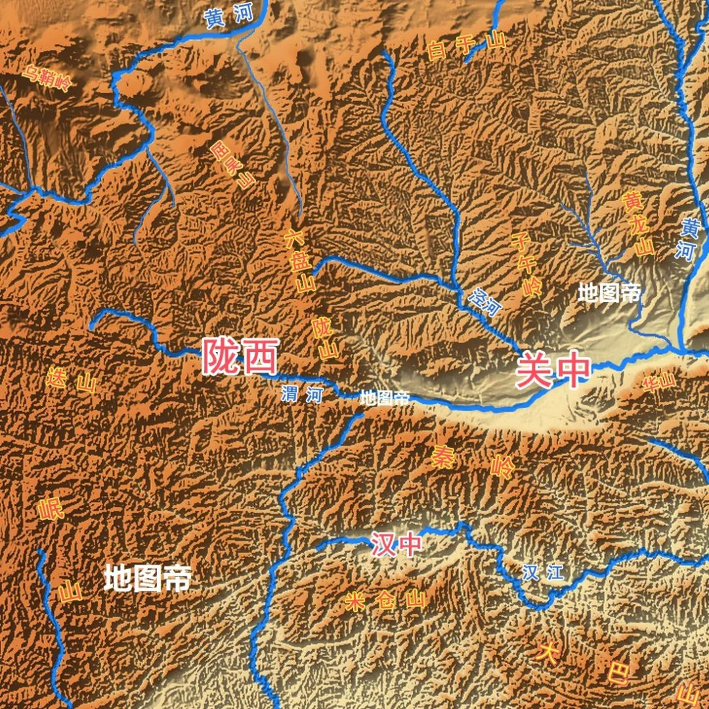 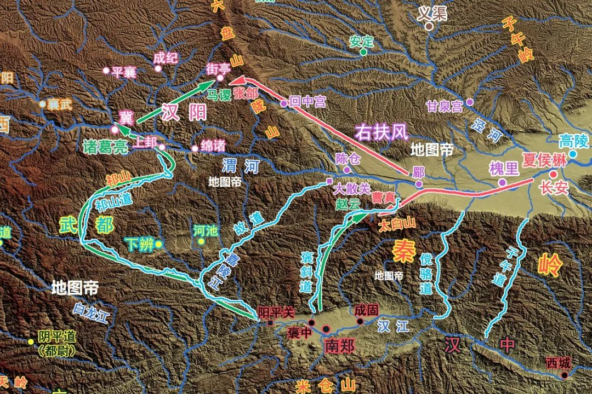 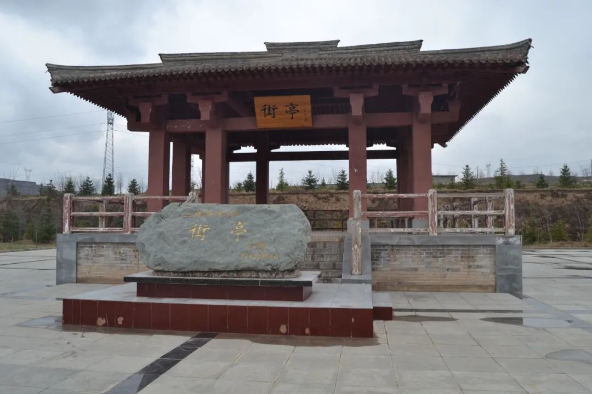

>**[31] 陈仓**：[陈仓区](https://baike.baidu.com/item/陈仓区/2695875?fromtitle=陈仓&fromid=3583506)，隶属陕西省宝鸡市，位于陕西省西部，南依秦岭与太白县、凤县毗邻，北靠陇山余脉与宝鸡市凤翔区、陇县、千阳县接壤，西沿渭水与甘肃省天水市麦积区、清水县隔河相望，东与岐山县相连，三面环围宝鸡市金台区、渭滨区二区，总面积2580平方千米。地图位置请参考[30]。

`青龙`元年[32]，穿`成国渠`，筑`临晋陂`，溉田数千顷，国以充实。

>**[32] 青龙元年**：[青龙](https://baike.baidu.com/item/青龙/2335892?fromModule=lemma_sense-layer#viewPageContent)，是魏明帝曹叡的第二个年号，也是曹魏的第三个年号，从公元233年开始，到公元237年结束，记5年。

二年，`亮`又率众十余万出`斜谷`[33]，垒于`郿`之`渭水`南原。天子忧之，遣征`蜀`护军`秦朗`督步骑二万，受帝节度。诸将欲住`渭`北以待之，帝曰：“百姓积聚皆在`渭`南，此必争之地也。”遂引军而济，背水为垒。因谓诸将曰：“`亮`若勇者，当出`武功`[34]依山而东，若西上`五丈原`[35]，则诸军无事矣。”`亮`果上原，将北渡`渭`，帝遣将军`周当`屯`阳遂`以饵之。数日，`亮`不动。帝曰：“`亮`欲争原而不向`阳遂`，此意可知也。”遣将军`胡遵`、`雍州`刺史`郭淮`共备`阳遂`，与`亮`会于`积石`，临原而战，`亮`不得进，还于`五丈原`。会有长星坠`亮`之垒，帝知其必败，遣奇兵掎`亮`之后，斩五百余级，获生口千余，降者六百余人。

>**[33] 斜谷**：[褒斜谷](https://baike.baidu.com/item/褒斜谷?fromModule=lemma_search-box)系一地理范畴，亦有南谷、北谷之分，也即除某些时候用褒谷或斜谷统称褒斜，褒谷与斜谷并非涵盖整条褒斜谷，而各有其分野。褒水和斜水（今石头河）均发源于秦岭深处的太白县，前者南流入汉水，后者北流入渭水，两者河谷统称“褒斜谷”，长约250千米，自古即为沟通秦岭南北的要道。地图位置请参考[30]中的褒斜道。

>**[34] 武功**：[鳌山](https://baike.baidu.com/item/鳌山/13783226?fromtitle=武功山&fromid=53571910#viewPageContent)属于秦岭的主脉。古称垂山、武功山，中隔跑马梁与拔仙台东西遥遥相望，又称西太白。主峰海拔3476米，最高峰麦秸岭海拔为3520米，太白境内秦岭第二独立高峰。鳌山位于陕西省宝鸡市太白县县城东南25千米处，为渭河一级支流石头河（武功水）和汉江二级支流红岩河（虢川河）的发源地。

>**[35] 五丈原**：[五丈原](https://baike.baidu.com/item/五丈原/1371894)，位于今陕西省宝鸡市岐山县，为秦岭北麓黄土台原的一部分，海拔约750米，原上地势平坦，面积南北长约4公里，东西宽约1.8公里。南靠秦岭，北临渭水，东西皆深沟，形势险要。五丈原为三国时诸葛亮北伐曹魏、屯兵用武、死而后已的古战场。三国时期，诸葛亮屯兵五丈原与司马懿隔渭河对阵，后因积劳成疾病逝于五丈原，五丈原由此闻名于世。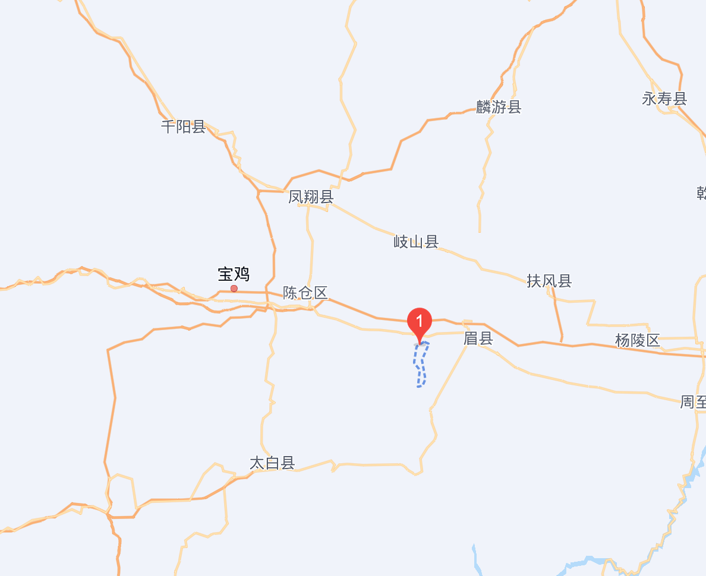

时朝廷以`亮`侨军远寇，利在急战，每命帝持重，以候其变。`亮`数挑战，帝不出，因遗帝巾帼妇人之饰。帝怒，表请决战，天子不许，乃遣骨鲠臣卫尉`辛毗`杖节为军师以制之。后`亮`复来挑战，帝将出兵以应之，`毗`杖节立军门，帝乃止。初，`蜀`将`姜维`闻`毗`来，谓`亮`曰：“`辛毗`杖节而至，贼不复出矣。”`亮`曰：“彼本无战心，所以固请者，以示武于其众耳。将在军，君命有所不受，苟能制吾，岂千里而请战邪！”

帝弟`孚`书问军事，帝复书曰：“`亮`志大而不见机，多谋而少决，好兵而无权，虽提卒十万，已堕吾画中，破之必矣。”与之对垒百余日，会`亮`病卒，诸将烧营遁走，百姓奔告，帝出兵追之。`亮`长史`杨仪`反旗鸣鼓，若将距帝者。帝以穷寇不之逼，于是`杨仪`结阵而去。经日，乃行其营垒，观其遗事，获其图书、粮谷甚众。帝审其必死，曰：“天下奇才也。”`辛毗`以为尚未可知。帝曰：“军家所重，军书密计、兵马粮谷，今皆弃之，岂有人捐其五藏而可以生乎？宜急追之。”关中多蒺藜，帝使军士二千人著软材平底木屐前行，蒺藜悉著屐，然后马步俱进。追到`赤岸`，乃知`亮`死审问，时百姓为之谚曰：“死`诸葛`走生`仲达`。”帝闻而笑曰：“吾便料生，不便料死故也。”

先是，`亮`使至，帝问曰：“`诸葛公`起居何如，食可几米？”对曰：“三四升。”次问政事，曰：“二十罚已上皆自省览。”帝既而告人曰：“`诸葛孔明`其能久乎！”竟如其言。`亮`部将`杨仪`、`魏延`争权，`仪`斩`延`，并其众。帝欲乘隙而进，有诏不许。

　　三年，迁太尉，累增封邑。`蜀`将`马岱`入寇，帝遣将军`牛金`击走之，斩千余级。

`武都`[36]`氐王` `苻双`、`强端`帅其属六千余人来降。

>**[36] 武都郡**：[武都郡](https://baike.baidu.com/item/武都郡/7959442?fromModule=lemma_inlink)，秦汉时开始设置，郡治在今成县以西。其时，郡治内多有氐族、羌族。王莽时改武都郡为乐平郡。东汉前期，罢平乐道、嘉陵道、循成道三道，郡治移至下辨县（县治在今甘肃省成县西北），改属凉州刺史部。汉安帝永初五年（111年），陇西郡羌道别属武都郡。汉末，曹操弃武都郡，迁其人口于右扶风小槐里，武都郡遂为蜀汉占据。西晋时武都改属秦州。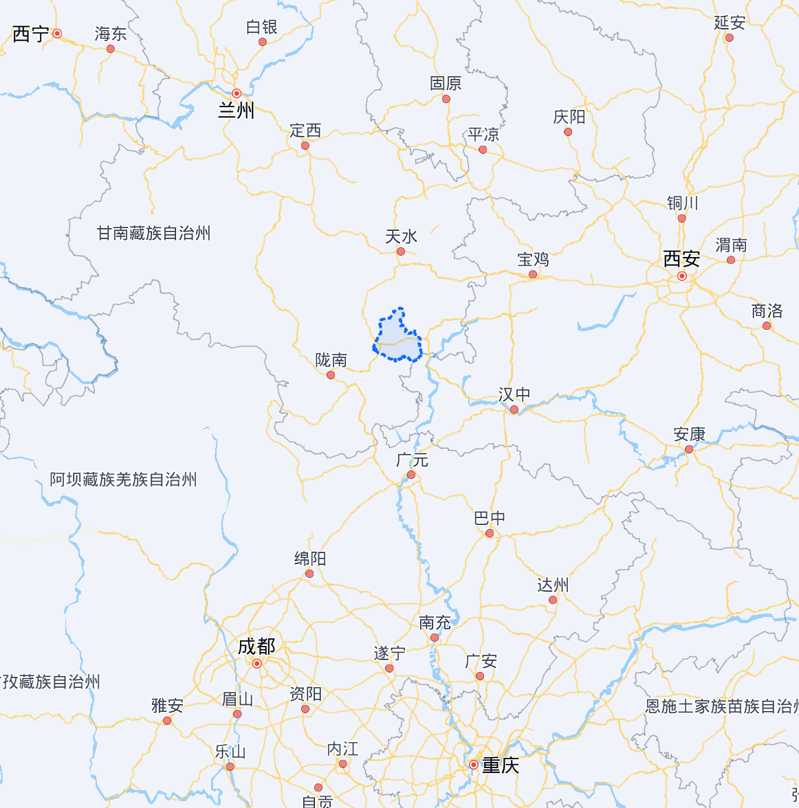

`关`东饥，帝运`长安`粟五百万斛于京师。

　　四年，获白鹿，献之。天子曰：“昔`周公` `旦`辅`成王`，有素雉之贡。今君受`陕`西之任，有白鹿之献，岂非忠诚协符，千载同契，俾乂邦家，以永厥休邪！”

及`辽东`[37]太守`公孙文懿`反，征帝诣京师。天子曰：“此不足以劳君，事欲必克，故以相烦耳。君度其行何计？”对曰：“弃城预走，上计也。据`辽水`[38]以距大军，次计也。坐守`襄平`，此成擒耳。”天子曰：“其计将安出？”对曰：“惟明者能深度彼己，豫有所弃，此非其所及也。今悬军远征，将谓不能持久，必先距`辽水`而后守，此中下计也。”天子曰：“往还几时？”对曰：“往百日，还百日，攻百日，以六十日为休息，一年足矣。”

>**[37] 辽东**：[辽东郡](https://baike.baidu.com/item/辽东郡?fromModule=lemma_search-box)，中国古代郡级行政区，范围约在今的辽宁省、吉林省东南部，下辖朝鲜障塞、真番障塞。战国时期燕国燕昭王姬职置郡。郡治襄平（今辽宁省辽阳市），辖大凌河以东，辽水以东，朝鲜清川江下游附近地区。西晋时改为辽东国，后复郡。十六国后燕末（晋元兴三年）部分地被高句丽占有。北燕又侨置辽东郡于今辽宁西部。北齐时废。

>**[38] 辽水**：[辽河](https://baike.baidu.com/item/辽河/36176)，中国东北地区南部河流。汉代以前称句骊河，汉代称大辽河，五代以后称辽河。辽河发源于河北省平泉市七老图山脉的光头山，流经河北、内蒙古、吉林、辽宁四省（自治区），盘山县双台子河口注入渤海，全长1345公里，流域面积21.9万平方公里。是中国七大河流之一。

是时大修宫室，加之以军旅，百姓饥弊。帝将即戎，乃谏曰：“昔`周公`营`洛邑`，`萧何`造`未央`，今宫室未备，臣之责也。然自`河`以北，百姓困穷，外内有役，势不并兴，宜假绝内务，以救时急。”

　　`景初`[39]二年，帅`牛金`、`胡遵`等步骑四万发自京都。车驾送出`西明门`。诏弟`孚`、子`师`送过`温`，赐以谷帛牛酒，敕郡守典农以下皆往会焉。见父老故旧，宴饮累日。帝叹息，怅然有感，为歌曰：“天地开辟，日月重光。遭遇际会，毕力遐方。将扫群秽，还过故乡。肃清万里，总齐八荒。告成归老，待罪`舞阳`。”遂进师，经`孤竹`[40]，越`碣石`[41]，次于`辽水`。`文懿`果遣步骑数万，阻`辽隧`，坚壁而守，南北六七十里，以距帝。帝盛兵多张旗帜，出其南，贼尽锐赴之。乃泛舟潜济以出其北，与贼营相逼，沈舟焚梁，傍`辽水`作长围，弃贼而向`襄平`。诸将言曰：“不攻贼而作围，非所以示众也。”帝曰：“贼坚营高垒，欲以老吾兵也。攻之，正入其计，此`王邑`所以耻过`昆阳`也。古人曰，敌虽高垒，不得不与我战者，攻其所必救也。贼大众在此，则巢窟虚矣。我直指`襄平`，则人怀内惧，惧而求战，破之必矣。”遂整阵而过。贼见兵出其后，果邀之。帝谓诸将曰：“所以不攻其营，正欲致此，不可失也。”乃纵兵逆击，大破之，三战皆捷。贼保`襄平`，进军围之。

>**[39] 景初**：[景初](https://baike.baidu.com/item/景初?fromModule=lemma_search-box)（237年三月-239年）是三国时期魏明帝曹叡的第三个年号，历时3年，这也是曹魏政权的第四个年号。青龙五年三月改元并改用景初历，以建丑之月(夏历十二月)为正月。因此青龙五年三月则成为景初元年四月。 景初三年正月齐王曹芳即位沿用。

>**[40] 孤竹**：[孤竹国](https://baike.baidu.com/item/孤竹国/5839267?fromModule=lemma_inlink)是中国商周时期北方地区燕山南麓、今河北东北部和辽宁西部地区一个重要的诸侯国，其文化与殷商文化有着重要联系，是中国古代北方的著名古国。国都在今河北卢龙地区。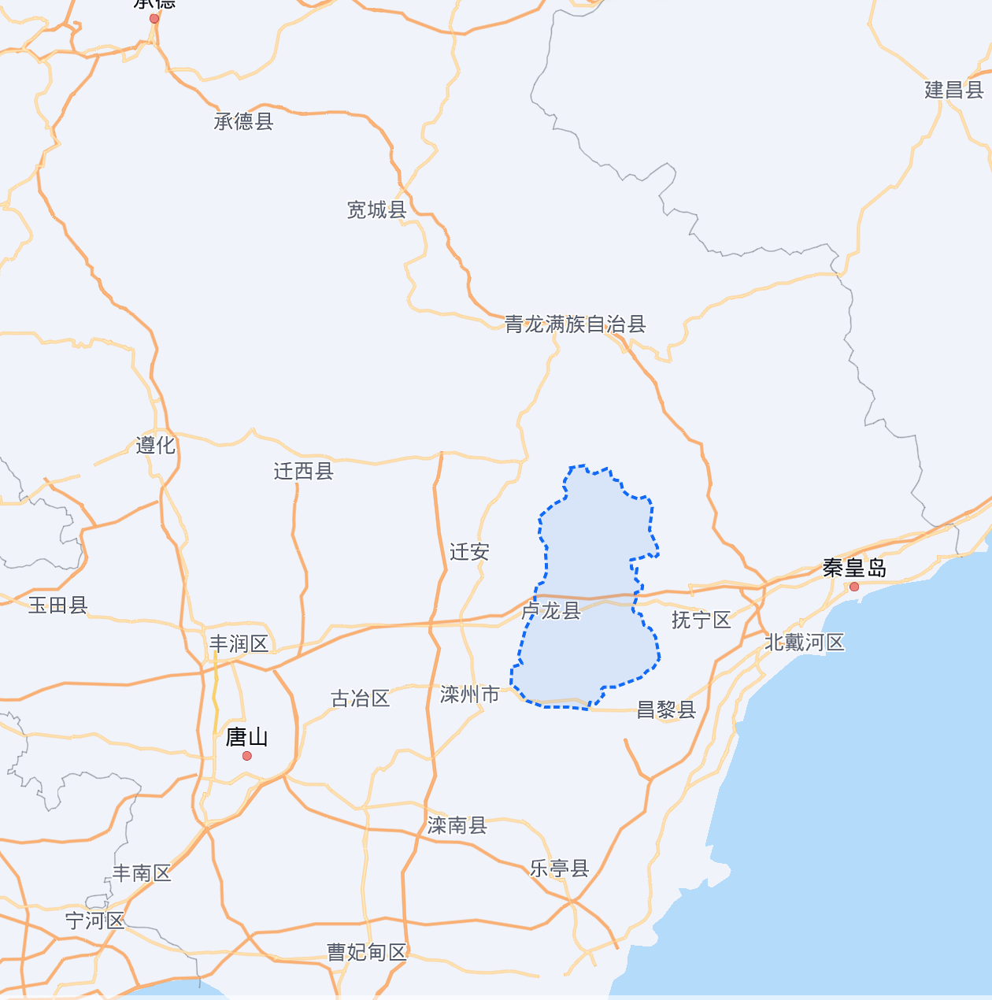

>**[41] 碣石**：[碣石山](https://baike.baidu.com/item/碣石山/70202)，又称碣石，古代名山之一，位于河北省秦皇岛市昌黎县、抚宁区、卢龙县3县（区）交界处，南北长24公里，东西宽20公里，占地面积320平方公里，为燕山山脉伸向渤海的余脉。碣石山主峰仙台顶，俗称娘娘顶，又名“汉武台”，位于昌黎县，海拔695.1米，是渤海近岸的最高峰。

初，`文懿`闻`魏`师之出也，请救于`孙权`。`权`亦出兵遥为之声援，遗`文懿`书曰：“`司马公`善用兵，变化若神，所向无前，深为弟忧之。”

会霖潦，大水，平地数尺，三军恐，欲移营。帝令军中敢有言徙者斩。都督令史`张静`犯令，斩之，军中乃定。贼恃水，樵牧自若。诸将欲取之，皆不听。司马`陈珪`曰：“昔攻`上庸`，八部并进，昼夜不息，故能一旬之半，拔坚城，斩`孟达`。今者远来而更安缓，愚窃惑焉。”帝曰：“`孟达`众少而食支一年，吾将士四倍于`达`而粮不淹月，以一月图一年，安可不速？以四击一，正令半解，犹当为之。是以不计死伤，与粮竞也。今贼众我寡，贼饥我饱，水雨乃尔，功力不设，虽当促之，亦何所为。自发京师，不忧贼攻，但恐贼走。今贼粮垂尽，而围落未合，掠其牛马，抄其樵采，此故驱之走也。夫兵者诡道，善因事变。贼凭众恃雨，故虽饥困，未肯束手，当示无能以安之。取小利以惊之，非计也。”朝廷闻师遇雨，咸请召还。天子曰：“`司马公`临危制变，计日擒之矣。”既而雨止，遂合围。起土山地道，楯橹钩橦[42]，发矢石雨下，昼夜攻之。

>**[42]**：楯橹[dùn lǔ]，盾与橹。橹，大盾。橦 chōng，古代的冲锋车。通“䡴”。

时有长星，色白，有芒鬣，自`襄平`城西南流于东北，坠于`梁水`[43]，城中震慑。`文懿`大惧，乃使其所署相国`王建`、御史大夫`柳甫`乞降，请解围而缚。不许，执`建`等，皆斩之。檄告`文懿`曰：“昔`楚` `郑`列国，而`郑伯`犹肉袒牵羊而迎之。孤为王人，位则上公，而`建`等欲孤解围退舍，岂`楚` `郑`之谓邪！二人老耄，必传言失旨，已相为斩之。若意有未已，可更遣年少有明决者来。”`文懿`复遣侍中`卫演`乞克日送任。帝谓`演`曰：“军事大要有五，能战当战，不能战当守，不能守当走，余二事惟有降与死耳。汝不肯面缚，此为决就死也，不须送任。”`文懿`攻南围突出，帝纵兵击败之，斩于`梁水`之上星坠之所。既入城，立两标以别新旧焉。男子年十五已上七千余人皆杀之，以为京观[44]。伪公卿已下皆伏诛，戮其将军`毕盛`等二千余人。收户四万，口三十余万。

>**[43] 梁水**：[太子河](https://baike.baidu.com/item/太子河?fromModule=lemma_search-box)是辽宁省较大河流之一，位于辽宁省东部。太子河古称衍水，汉称大梁河，辽称东梁河，金时称无鲁呼必喇沙，满语意为芦苇河，明称太子河，清称太资河，即今之太子河。太子河地名来源于战国时燕国太子丹。浑河支流，其上游有二源：北太子河源出新宾县南，南太子河源出本溪县东，在北甸附近汇合后，西流本溪市、辽阳市，至海城市三岔河附近注入大辽河，大辽河流经营口市区注入渤海辽东湾。长413公里，流域面积13883平方公里，流量106立方米/秒，落差463米。

>**[44] 京观**：[京观](https://baike.baidu.com/item/京观?fromModule=lemma_search-box)，古代为炫耀武功，聚集敌尸，封土而成的高冢。京观：京，谓高丘也；观，阙型也。古人杀贼，战捷陈尸，必筑京观，以为藏尸之地。古之战场所在有之。

初，`文懿`篡其叔父`恭`位而囚之。及将反，将军`纶直`、`贾范`等苦谏，`文懿`皆杀之。帝乃释`恭`之囚，封`直`等之墓，显其遗嗣。令曰：“古之伐国，诛其鲸鲵而已，诸为`文懿`所诖误者，皆原之。中国人欲还旧乡，恣听之。”

时有兵士寒冻，乞襦[45]，帝弗之与。或曰：“幸多故襦，可以赐之。”帝曰：“襦者官物，人臣无私施也。”乃奏军人年六十已上者罢遣千余人，将吏从军死亡者致丧还家。遂班师。天子遣使者劳军于`蓟`，增封食`昆阳`，并前二县。

>**[45] 襦**：rú，〈书〉短衣；短袄。

初，帝至`襄平`，梦天子枕其膝，曰：“视吾面。”俯视有异于常，心恶之。先是，诏帝便道镇`关`中；及次`白屋`，有诏召帝，三日之间，诏书五至。手诏曰：“间侧息望到，到便直排阁入，视吾面。”帝大遽，乃乘追锋车昼夜兼行，自`白屋`四百余里，一宿而至。引入`嘉福殿`卧内，升御床。帝流涕问疾，天子执帝手，目`齐王`曰：“以后事相托。死乃复可忍，吾忍死待君，得相见，无所复恨矣。”与大将军`曹爽`并受遗诏辅少主。

及`齐王`即帝位，迁侍中、持节、都督中外诸军、录尚书事，与`爽`各统兵三千人，共执朝政，更直殿中，乘舆入殿。`爽`欲使尚书奏事先由己，乃言于天子，徙帝为大司马。朝议以为前后大司马累薨于位，乃以帝为太傅。入殿不趋，赞拜不名[46]，剑履上殿，如`汉` `萧何`故事。嫁娶丧葬取给于官，以世子`师`为散骑常侍，子弟三人为列侯，四人为骑都尉。帝固让子弟官不受。

>**[46] 赞拜**：赞拜，读音为zàn bài，汉语词语，意思是古代举行朝拜、祭祀、婚礼仪式时，由赞导的人在旁唱导行礼。

　　`正始`[47]元年春正月，`东倭`重译纳贡，`焉耆`[48]、`危须`[49]诸国，`弱水`[50]以南，`鲜卑`名王，皆遣使来献。天子归美宰辅，又增帝封邑。

>**[47] 正始**：[正始](https://baike.baidu.com/item/正始/8795)（240年—249年四月）是三国时期曹魏的君主魏齐王曹芳的第一个年号，共计10年。这也是曹魏政权的第五个年号。

>**[48] 焉耆**：焉耆[yān qí]，地名来自《汉书·西域传》的焉耆国，又称为乌夷、阿耆尼，新疆塔里木盆地古国，出高昌故地，自近者始，曰阿耆尼国(旧曰焉耆)。今在新疆维吾尔自治区焉耆回族自治县附近。

>**[49] 危须**：汉代国名。王治危须城。汉西域三十六国之一。后并于焉耆国。故址在今新疆博斯腾湖北和硕县境内。

>**[50] 弱水**：[黑河](https://baike.baidu.com/item/黑河/12797121?fromtitle=弱水&fromid=83148)，古弱水（合黎山以北段）、黑水（一般指弱水下游黑河内蒙古段）。曾名合黎水、羌谷水、鲜水、覆表水、副投水、张掖水、甘州河。是中国西北地区第二大内陆河，甘肃省最大的内陆河。发源于祁连山北麓中段，流经青海、甘肃、内蒙古自治区三省（自治区）。下游称弱水（古弱水）。其中内蒙古境内河段称额济纳旗河（额济纳河，西夏语黑水），在居延海消失。 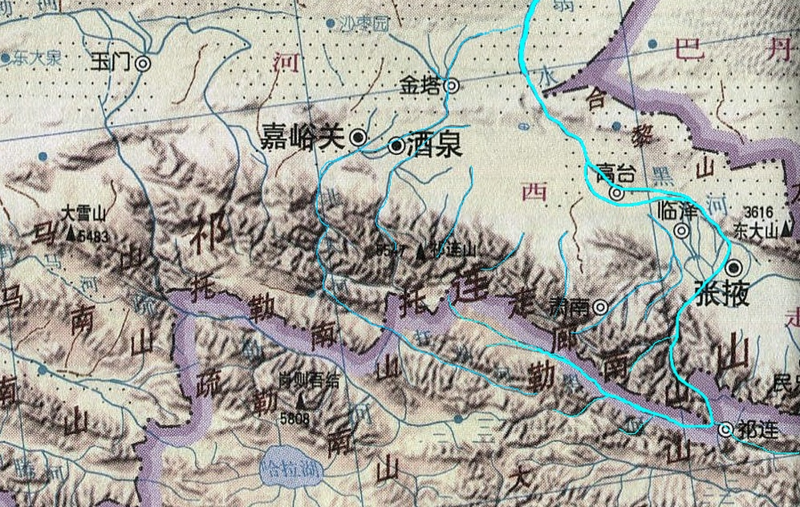 
参考词条：[弱水三千，霍去病一万骑，是如何杀敌一万七千的？](https://baike.baidu.com/tashuo/browse/content?id=0973544b92efb626d77cdc77&lemmaId=12797121&fromLemmaModule=pcRight&lemmaTitle=黑河&fromModule=lemma_right-tashuo-article)

初，`魏明帝`好修宫室，制度靡丽，百姓苦之。帝自`辽东`还，役者犹万余人，雕玩之物动以千计。至是皆奏罢之，节用务农，天下欣赖焉。

　　二年夏五月，`吴`将`全琮`[51]寇`芍陂`[52]，`朱然`、`孙伦`围`樊城`[53]，`诸葛瑾`、`步骘`[54]掠`柤中`[55]，帝请自讨之。议者咸言，贼远来围`樊`，不可卒拔。挫于坚城之下，有自破之势，宜长策以御之。帝曰：“边城受敌而安坐庙堂，疆场骚动，众心疑惑，是社稷之大忧也。”

>**[51] 琮**：[琮cóng](https://hanyu.baidu.com/hanyu-page/zici/s?wd=琮)，古时的一种玉器，筒状，外边八角，中间圆形。

>**[52] 芍陂**：[芍陂](https://baike.baidu.com/item/芍陂?fromModule=lemma_search-box)（què bēi）是由春秋时楚相孙叔敖主持修建的水利工程。1949年后经过整治，现蓄水约7300万立方米，灌溉面积4.2万公顷。迄今虽已有2500多年，但其一直发挥着不同程度的灌溉效益。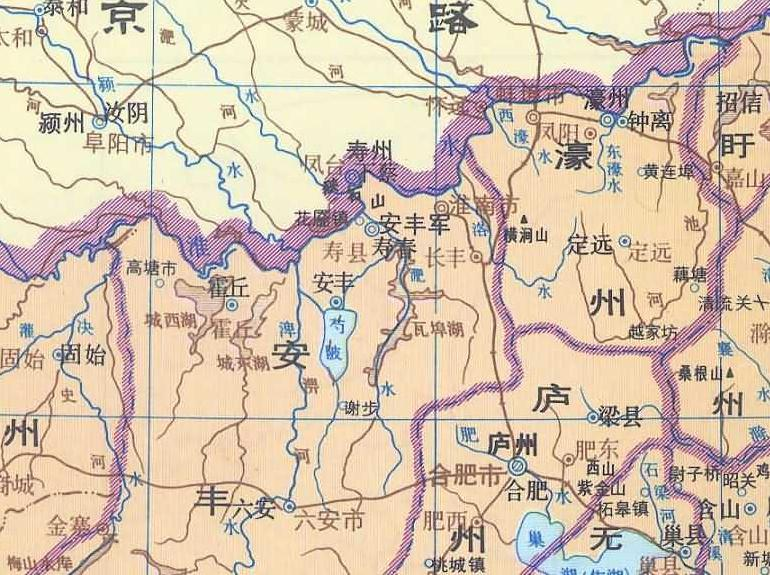 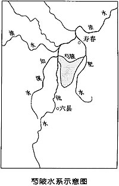 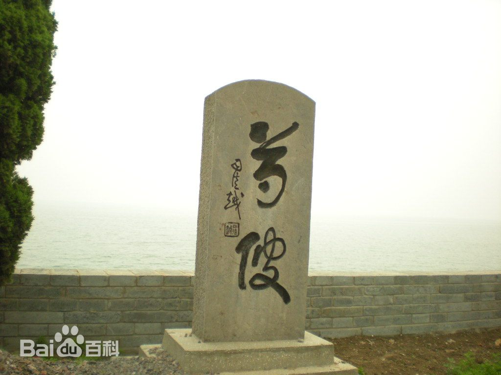

>**[53] 樊城**：今襄阳市。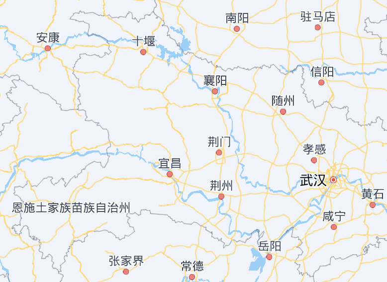

>**[54] 骘**：[骘 zhì](https://hanyu.baidu.com/hanyu-page/zici/s?wd=骘)，〈书〉公马。〈书〉升；登。

>**[55] 柤中**：地区名。一作[沮(zǔ)中](https://www.guoxuemi.com/diming/38721zgem/)。在今湖北南漳县西蛮河流域。《三国志· 吴书 · 朱然传》： 赤乌五年(242)，“征柤中”。裴注引 《襄阳记》 曰： “柤音如租税之租。柤中在上黄界，去襄阳一百五十里。魏时夷王梅敷兄弟三人，部曲万余家屯此，分布在中庐、宜城西山鄢、沔二谷中，土地平敞，宜桑麻，有水陆良田，沔南之膏腴沃壤，谓之柤中。” 一说指今湖北沮河上游地区。

六月，乃督诸军南征，车驾送出`津阳门`。帝以南方暑湿，不宜持久，使轻骑挑之，`然`不敢动。于是休战士，简精锐，募先登，申号令，示必攻之势。`吴`军夜遁走，追至`三州口`[56]，斩获万余人，收其舟船军资而还。天子遣侍中常侍劳军于`宛`[57]。

>**[56] 三州口**：[三州口](https://www.guoxuemi.com/diming/1153jqyq/)在今湖北襄阳县东唐白河入汉江处。《水经·沔水注》：“襄阳城东有白沙， 白沙北有三洲。”《晋书·宣帝纪》：魏正始二年(241)，吴将朱然围樊城，司马懿督军往援，“吴军夜遁走，追至三洲口”。即此。 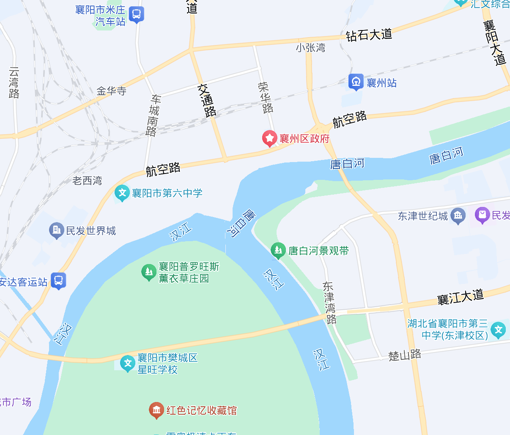

>**[57] 宛**：[宛](https://baike.baidu.com/item/宛/13332759?fromModule=lemma_sense-layer#viewPageContent)是河南省南阳市的简称，南阳地处南阳盆地，三面环山，宛字反映出了南阳的盆地地貌，在春秋战国时期，已有宛城之称。 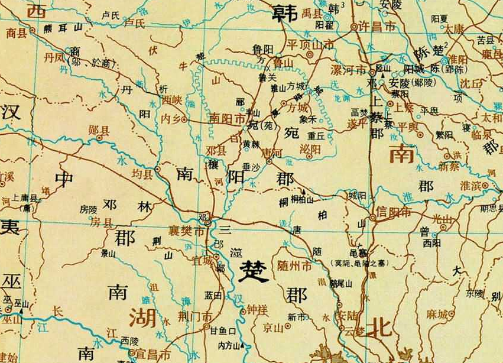

秋七月，增封食`郾`[58]、`临颍`[59]，并前四县，邑万户，子弟十一人皆为列侯。帝勋德日盛，而谦恭愈甚。以太常`常林`乡邑旧齿，见之每拜。恒戒子弟曰：“盛满者道家之所忌，四时犹有推移，吾何德以堪之。损之又损之，庶可以免乎？”

>**[58] 郾**：读作郾（yǎn），其本意为古县名。今漯河市郾城区。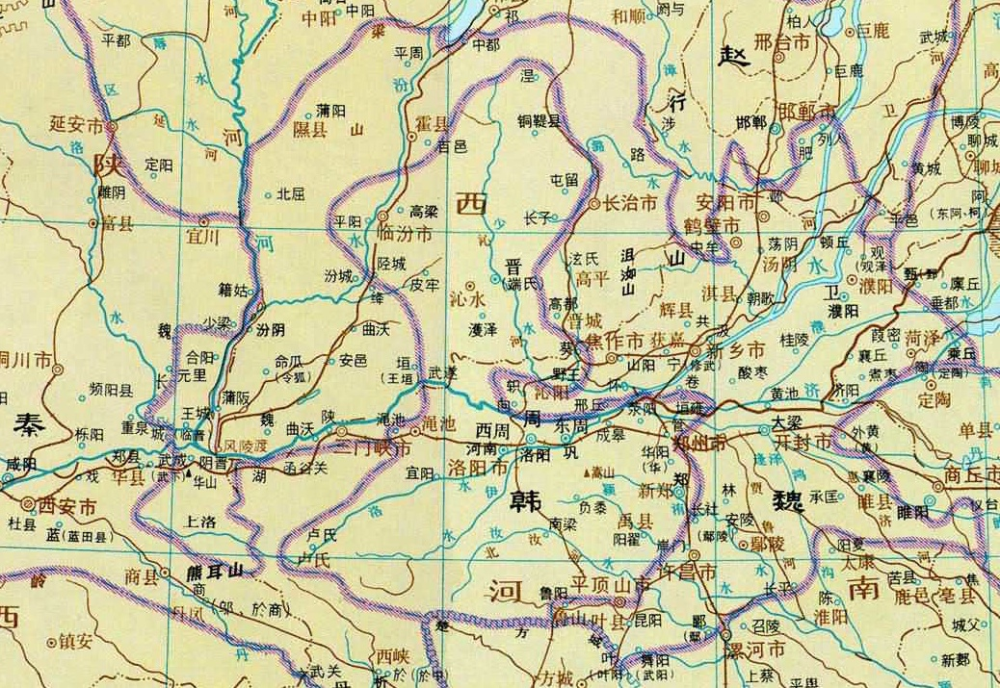

>**[59] 临颍**：[临颍县](https://baike.baidu.com/item/临颍县?fromModule=lemma_search-box)，隶属河南省漯河市，位于河南省中部，东接鄢陵县、西华县，西与襄城县毗邻，南连郾城区，北邻建安区，总面积821平方千米。 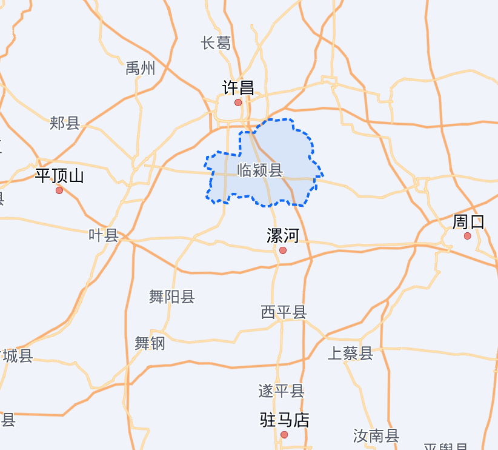

　　三年春，天子追封，谥皇考`京兆`尹为`舞阳成侯`。

三月，奏穿`广漕渠`，引`河`入`汴`[60]，溉东南诸陂，始大佃于`淮`[61]北。

>**[60] 汴**：[汳水](https://baike.baidu.com/item/汳水?fromModule=lemma_search-box)，即汴水、丹水，是泗水的一条重要支流，河长约300多公里。汳水自今河南开封市西北的蒗荡渠，经开封市、杞县、民权县，宁陵县，流入商丘市睢阳区、梁园区，接河南商丘市西北的甾获渠，又东北经山东曹县南部边界，流入虞城县北境，东经夏邑县北、永城市北，又经安徽省萧县北，流入江苏省徐州市西境，于城北汇入泗水。这一河段又称为“获水”，亦兼丹水之称。 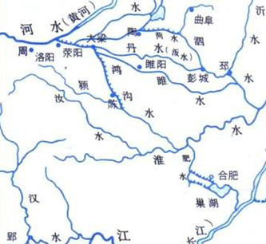

>**[61] 淮**：[淮河](https://baike.baidu.com/item/淮河/230880?fromModule=disambiguation)，古称淮水，与长江、黄河、济水并称“四渎”，当代已被列为我国七大江河之一。淮河发源于河南省南阳市桐柏县桐柏山太白顶西北侧河谷，干流流经湖北、河南、安徽、江苏四省，于江苏省扬州市三江营入江，流域地跨湖北、河南、安徽、江苏、山东五省。   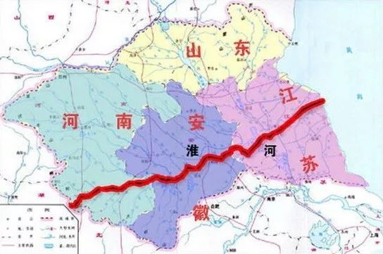

先是，`吴`遣将`诸葛恪`屯`皖`，边鄙苦之，帝欲自击`恪`。议者多以贼据坚城，积谷，欲引致官兵，今悬军远攻，其救必至，进退不易，未见其便。帝曰：“贼之所长者水也，今攻其城，以观其变。若用其所长，弃城奔走，此为庙胜也。若敢固守，湖水冬浅，船不得行，势必弃水相救，由其所短，亦吾利也。”

　　四年秋九月，帝督诸军击`诸葛恪`，车驾送出`津阳门`。军次于`舒`[62]，`恪`焚烧积聚，弃城而遁。

>**[62] 舒**：[舒城县](https://baike.baidu.com/item/舒城县?fromModule=lemma_search-box)，隶属于安徽省六安市，位于安徽省中部、长三角腹地、巢湖之滨，江淮之间、紧邻合肥。 

帝以灭贼之要，在于积谷，乃大兴屯守，广开`淮阳`[63]、`百尺`二渠，又修诸陂于`颍`[64]之南北，万余顷。自是`淮`北仓庾相望，`寿阳`[65]至于京师，农官屯兵连属焉。

>**[63] 淮阳**：今属周口市，地图位置参考备注[64]。

>**[64] 颍**：[颍河](https://baike.baidu.com/item/颍河/9736522)，古称颍水，相传因纪念春秋郑人颍考叔而得名。其主要支流为沙河，因此也被称为沙河或沙颍河。颍河属淮河的支流。位于淮河北岸，河南省东部与安徽省西北部。 发源于河南省登封市嵩山（一说伏牛山脉摩天岭东麓），经周口市、安徽省阜阳市，在寿县正阳关（颍上县沫河口）注入淮河，全长620公里（一说619千米），覆盖流域面积达3.67万平方千米。是淮河流域中长度最长、覆盖面积最广的支流之一。年均天然径流量为6.95亿立米（一说年均径流量达7.78亿立方米）。主要支流包有沙河、北汝河、澧河以及贾鲁河和汾河。 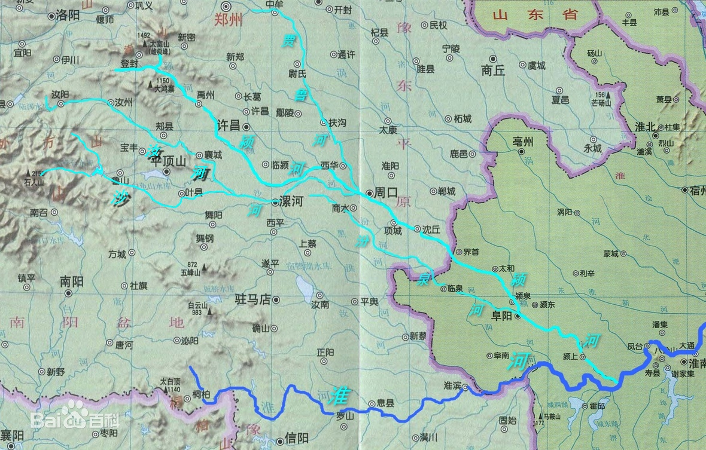

　　五年春正月，帝至自`淮`南，天子使持节劳军。

尚书`邓扬`、`李胜`等欲令`曹爽`建立功名，劝使伐`蜀`。帝止之，不可，`爽`果无功而还。

　　六年秋八月，`曹爽`毁中垒中坚营，以兵属其弟中领军`羲`，帝以先帝旧制禁之不可。

冬十二月，天子诏帝朝会乘舆升殿。

　　七年春正月，`吴`寇`柤中`，夷夏万余家避寇北渡`沔`。帝以`沔`南近贼，若百姓奔还，必复致寇，宜权留之。`曹爽`曰：“今不能修守`沔`南而留百姓，非长策也。”帝曰：“不然。凡物致之安地则安。危地则危。故兵书曰‘成败，形也；安危，势也’。形势，御众之要，不可以不审。设令贼以二万人断`沔水`，三万人与`沔`南诸军相持，万人陆梁`柤中`，将何以救之？”`爽`不从，卒令还南。贼果袭破`柤中`，所失万计。
　　
　　八年夏四月，夫人`张氏`薨。

`曹爽`用`何晏`、`邓扬`、`丁谧`之谋，迁太后于`永宁宫`，专擅朝政，兄弟并典禁兵，多树亲党，屡改制度。帝不能禁，于是与`爽`有隙。

五月，帝称疾不与政事。时人为之谣曰：“`何`、`邓`、`丁`，乱京城。”

　　九年春三月，黄门`张当`私出掖庭才人`石英`等十一人，与`曹爽`为伎人。`爽`、`晏`谓帝疾笃，遂有无君之心，与当密谋，图危社稷，期有日矣。帝亦潜为之备，`爽`之徒属亦颇疑帝。会`河南`尹`李胜`将莅`荆州`，来候帝。帝诈疾笃，使两婢侍，持衣衣落，指口言渴，婢进粥，帝不持杯饮，粥皆流出沾胸。`胜`曰：“众情谓明公旧风发动，何意尊体乃尔！”帝使声气才属，说“年老枕疾，死在旦夕。君当屈`并州`，`并州`近胡，善为之备。恐不复相见，以子`师`、`昭`兄弟为托。”`胜`曰：“当还忝本州，非`并州`。”帝乃错乱其辞曰：“君方到`并州`。”`胜`复曰：“当忝`荆州`。”帝曰：“年老意荒，不解君言。今还为本州，盛德壮烈，好建功勋！”`胜`退告`爽`曰：“`司马公`尸居余气，形神已离，不足虑矣。”他日，又言曰：“太傅不可复济，令人怆然。”故`爽`等不复设备。

　　`嘉平`[65]元年春正月甲午，天子谒`高平陵`，`爽`兄弟皆从。是日，太白袭月。帝于是奏`永宁太后`，废`爽`兄弟。时`景帝`为中护军，将兵屯`司马门`。帝列阵阙下，经`爽`门。`爽`帐下督`严世`上楼，引弩将射帝，`孙谦`止之曰：“事未可知。”三注三止，皆引其肘不得发。大司农`桓范`出赴`爽`，`蒋济`言于帝曰：“智囊往矣。”帝曰：“`爽`与`范`内疏而智不及，驽马恋栈豆，必不能用也。”于是假司徒`高柔`节，行大将军事，领`爽`营，谓`柔`曰：“君为`周勃`矣。”命太仆`王观`行中领军，摄`羲`营。帝亲帅太尉`蒋济`等勒兵出迎天子，屯于`洛水`浮桥，上奏曰：“先帝诏陛下、`秦王`及臣升于御床，握臣臂曰‘深以后事为念’。今大将军`爽`背弃顾命，败乱国典，内则僭拟，外专威权。群官要职，皆置所亲；宿卫旧人，并见斥黜。根据盘牙，纵恣日甚。又以黄门`张当`为都监，专共交关，伺候神器。天下汹汹，人怀危惧。陛下便为寄坐，岂得久安？此非先帝诏陛下及臣升御床之本意也。臣虽朽迈，敢忘前言。昔`赵高`极意，秦是以亡；`吕` `霍`早断，`汉`祚永延。此乃陛下之殷鉴，臣授命之秋也。公卿群臣皆以`爽`有无君之心，兄弟不宜典兵宿卫；奏皇太后，皇太后敕如奏施行。臣辄敕主者及黄门令罢`爽`、`羲`、`训`吏兵，各以本官侯就第，若稽留车驾，以军法从事。臣辄力疾将兵诣`洛水`浮桥，伺察非常。”`爽`不通奏，留车驾宿`伊水`南，伐树为鹿角，发屯兵数千人以守。`桓范`果劝`爽`奉天子幸`许昌`，移檄征天下兵。`爽`不能用，而夜遣侍中`许允`、尚书`陈泰`诣帝，观望风旨。帝数其过失，事止免官。`泰`还以报`爽`，劝之通奏。帝又遣`爽`所信殿中校尉`尹大目`谕`爽`，指`洛水`为誓，`爽`意信之。`桓范`等援引古今，谏说万端，终不能从。乃曰：“`司马公`正当欲夺吾权耳。吾得以侯还第，不失为富家翁。”`范`拊膺曰：“坐卿。灭吾族矣！”遂通帝奏。既而有司劾黄门`张当`，并发`爽`与`何晏`等反事，乃收`爽`兄弟及其党与`何晏`、`丁谧`、`邓扬`、`毕轨`、`李胜`、`桓范`等诛之。`蒋济`曰：“`曹真`之勋，不可以不祀。”帝不听。

>**[65] 嘉平**：[嘉平](https://baike.baidu.com/item/嘉平/8797?fromModule=lemma_sense-layer#viewPageContent)（249年四月-254年十月），是三国时期曹魏的君主魏齐王曹芳的第二个年号，共计6年。这也是曹魏政权的第六个年号。

初，`爽`司马`鲁芝`、主簿`杨综`斩关奔`爽`。及`爽`之将归罪也，`芝`、`综`泣谏曰：“公居`伊` `周`之任，挟天子，杖天威，孰敢不从？舍此而欲就东市，岂不痛哉！”有司奏收`芝`、`综`科罪，帝赦之，曰：“以劝事君者。”

二月，天子以帝为丞相，增封`颍川`之`繁昌`、`鄢陵`、`新汲`、`父城`，并前八县，邑二万户，奏事不名。固让丞相。

冬十二月，加九锡之礼，朝会不拜。固让九锡[66]。

>**[66] 九锡**：[九锡](https://baike.baidu.com/item/九锡/2108880)（jiǔ xī），是中国古代皇帝赐给诸侯、大臣有殊勋者的九种礼器，是最高礼遇的表示。《后汉书·袁绍传》注引《礼·含文嘉》曰：“九锡一曰车马，二曰衣服，三曰乐器，四曰朱户，五曰纳陛，六曰虎贲之士百人，七曰斧钺，八曰弓矢，九曰秬鬯。”

　　二年春正月，天子命帝立庙于`洛阳`，置左右长史，增掾属、舍人满十人，岁举掾属任御史、秀才各一人，增官骑百人，鼓吹十四人，封子`肜` `平乐亭侯`，`伦` `安乐亭侯`。帝以久疾不任朝请，每有大事，天子亲幸第以谘访焉。

`兖州`[67]刺史`令狐愚`、太尉`王凌`贰于帝，谋立`楚王` `彪`。

>**[67] 兖州**：[兖州](https://baike.baidu.com/item/兖州/8454090?fromModule=lemma_sense-layer#viewPageContent)，是《尚书》中《禹贡》所描述的九州之一，古代不特指某地，是一个地理范围，大体位于古黄河和济水之间（今山东省西部、河南省东北部、河北省东南部）。范围和治所随历史多有变更。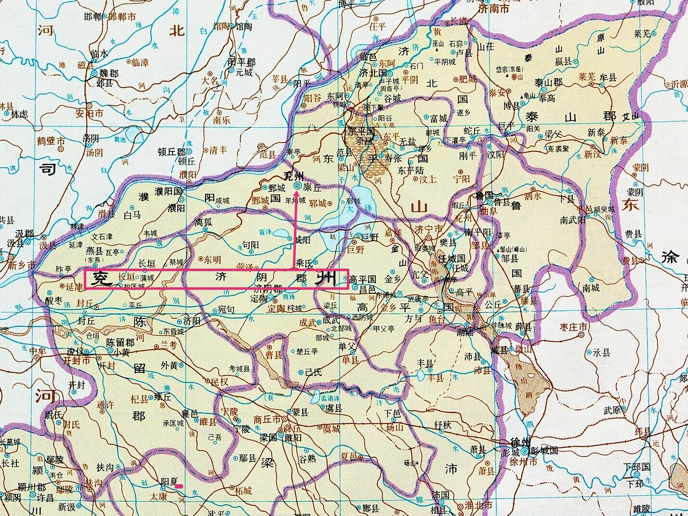

　　三年春正月，`王凌`诈言`吴`人塞`涂水`[68]，请发兵以讨之。帝潜知其计，不听。

>**[68] 涂水**：[滁河](https://baike.baidu.com/item/滁河?fromtitle=涂水&fromid=7204763&fromModule=lemma_search-box)位于江淮之间，系长江下游左岸一级支流，流经安徽、江苏两省，干流全长269公里。滁河古称涂水，唐代改名滁河。发源于安徽省合肥市肥东县梁园镇，主要流经安徽合肥市（肥东县）、滁州市、马鞍山（含山县）、马鞍山（和县）及南京江北，自南京市六合区龙袍街道入长江。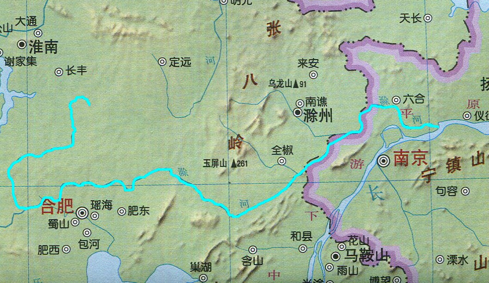

夏四月，帝自帅中军，泛舟沿流，九日而到`甘城`。`凌`计无所出，乃迎于`武丘`，面缚水次，曰：“`凌`若有罪，公当折简召`凌`，何苦自来邪！”帝曰：“以君非折简之客故耳。”即以`凌`归于京师。道经`贾逵`庙，`凌`呼曰：“`贾梁道`！`王凌`是`大魏`之忠臣，惟尔有神知之。”至`项`，仰鸩而死。收其余党，皆夷三族，并杀`彪`。悉录`魏`诸王公置于`邺`，命有司监察，不得交关。

天子遣侍中`韦诞`持节劳军于`五池`。帝至自`甘城`，天子又使兼大鸿胪、太仆`庾嶷`持节，策命帝为相国，封`安平郡公`，孙及兄子各一人为列侯，前后食邑五万户，侯者十九人。固让相国、郡公不受。

六月，帝寝疾，梦`贾逵`、`王凌`为祟，甚恶之。秋八月戊寅，崩于京师，时年七十三。天子素服临吊，丧葬威仪依`汉` `霍光`故事，追赠相国、郡公。弟`孚`表陈先志，辞郡公及辒辌车[69]。

>**[69] 辒辌**：[辒辌](https://baike.baidu.com/item/辒辌?fromModule=lemma_search-box)[wēn liáng]是古代可以卧的车，也用作丧车。有窗牖，出自《史记·李斯列传》：“ 李斯 以为上在外崩，无真太子，故秘之。置 始皇 居輼輬车中，百官奏事上食如故。”

九月庚申，葬于`河阴`，谥曰`文`，后改谥`宣文`。先是，预作终制，于`首阳山`[70]为土藏，不坟不树；作顾命三篇，敛以时服，不设明器，后终者不得合葬。一如遗命。`晋国`初建，追尊曰`宣王`。`武帝`受禅，上尊号曰`宣皇帝`，陵曰`高原`，庙称`高祖`。

>**[70] 首阳山**：[首阳山](https://baike.baidu.com/item/首阳山/10443508?fromModule=lemma_sense-layer#viewPageContent)位于河南洛阳市偃师区邙岭乡，为邙山在偃师境内的最高处，海拔359.1米，是邙山山脉的最高峰。因“日出之初，光必先及”而得名。首阳山镇，因境内有首阳山，故名。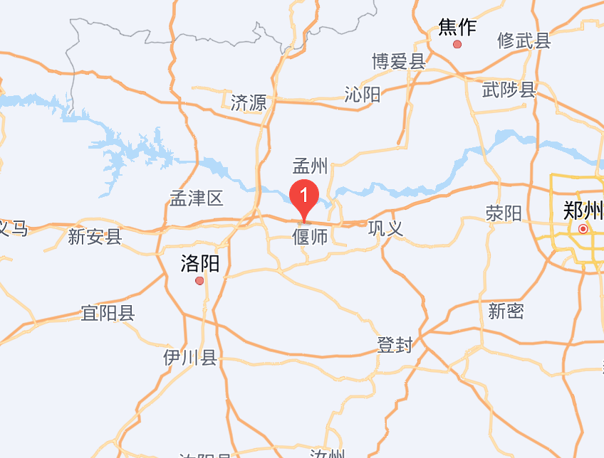

　　帝内忌而外宽，猜忌多权变。`魏武`察帝有雄豪志，闻有狼顾相。欲验之。乃召使前行，令反顾，面正向后而身不动。又尝梦三马同食一槽，甚恶焉。因谓太子`丕`曰：“`司马懿`非人臣也，必预汝家事。”太子素与帝善，每相全佑，故免。帝于是勤于吏职，夜以忘寝，至于刍牧之间，悉皆临履，由是`魏武`意遂安。及平`公孙文懿`，大行杀戮。诛`曹爽`之际，支党皆夷及三族，男女无少长，姑姊妹女子之适人者皆杀之，既而竟迁`魏`鼎云。

`明帝`时，`王导`侍坐。帝问前世所以得天下，`导`乃陈帝创业之始，及`文帝`末`高贵乡公`事。`明帝`以面覆床曰：“若如公言，`晋`祚复安得长远！”迹其猜忍，盖有符于狼顾也。

　　制曰：夫天地之大，黎元为本。邦国之贵，元首为先。治乱无常，兴亡有运。是故五帝之上，居万乘以为忧；三王已来，处其忧而为乐。竞智力，争利害，大小相吞，强弱相袭。逮乎`魏室`，三方鼎峙，干戈不息，氛雾交飞。`宣皇`以天挺之姿，应期佐命，文以缵治，武以棱威。用人如在己，求贤若不及；情深阻而莫测，性宽绰而能容，和光同尘，与时舒卷，戢鳞潜翼，思属风云。饰忠于已诈之心，延安于将危之命。观其雄略内断，英猷外决，殄`公孙`于百日，擒`孟达`于盈旬，自以兵动若神，谋无再计矣。既而拥众西举，与`诸葛`相持。抑其甲兵，本无斗志，遗其巾帼，方发愤心。杖节当门，雄图顿屈，请战千里，诈欲示威。且`秦` `蜀`之人，勇懦非敌，夷险之路，劳逸不同，以此争功，其利可见。而返闭军固垒，莫敢争锋，生怯实而未前，死疑虚而犹遁，良将之道，失在斯乎！`文帝`之世，辅翼权重，`许昌`同`萧何`之委，`崇华`甚`霍光`之寄。当谓竭诚尽节，`伊` `傅`可齐。及`明帝`将终，栋梁是属，受遗二主，佐命三朝，既承忍死之托，曾无殉生之报。天子在外，内起甲兵，陵土未乾，遽相诛戮，贞臣之体，宁若此乎！尽善之方，以斯为惑。夫征讨之策，岂东智而西愚？辅佐之心，何前忠而后乱？故`晋明`掩面，耻欺伪以成功；`石勒`肆言，笑奸回以定业。古人有云：“积善三年，知之者少，为恶一日，闻于天下。”可不谓然乎！虽自隐过当年，而终见嗤后代。亦犹窃钟掩耳，以众人为不闻；锐意盗金，谓市中为莫睹。故知贪于近者则遗远，溺于利者则伤名；若不损己以益人，则当祸人而福己。顺理而举易为力，背时而动难为功。况以未成之`晋`基，逼有余之`魏`祚？虽复道格区宇，德被苍生，而天未启时，宝位犹阻，非可以智竞，不可以力争，虽则庆流后昆，而身终于北面矣。