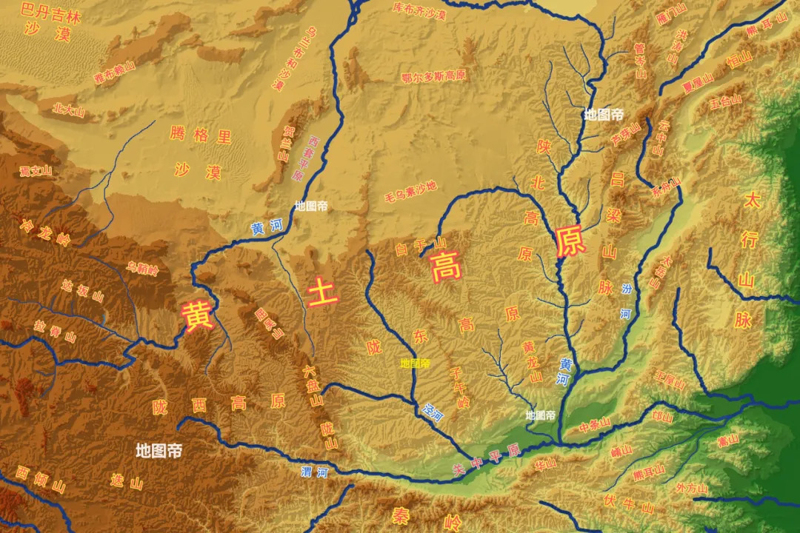
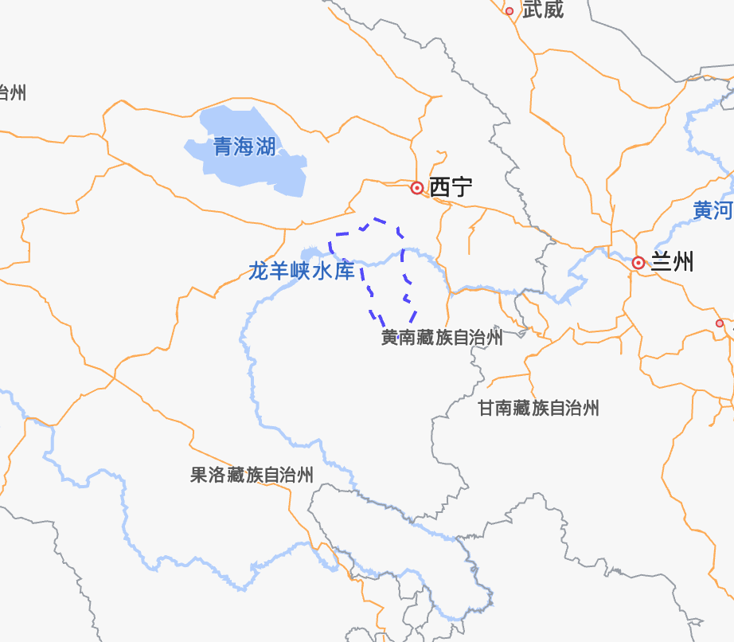
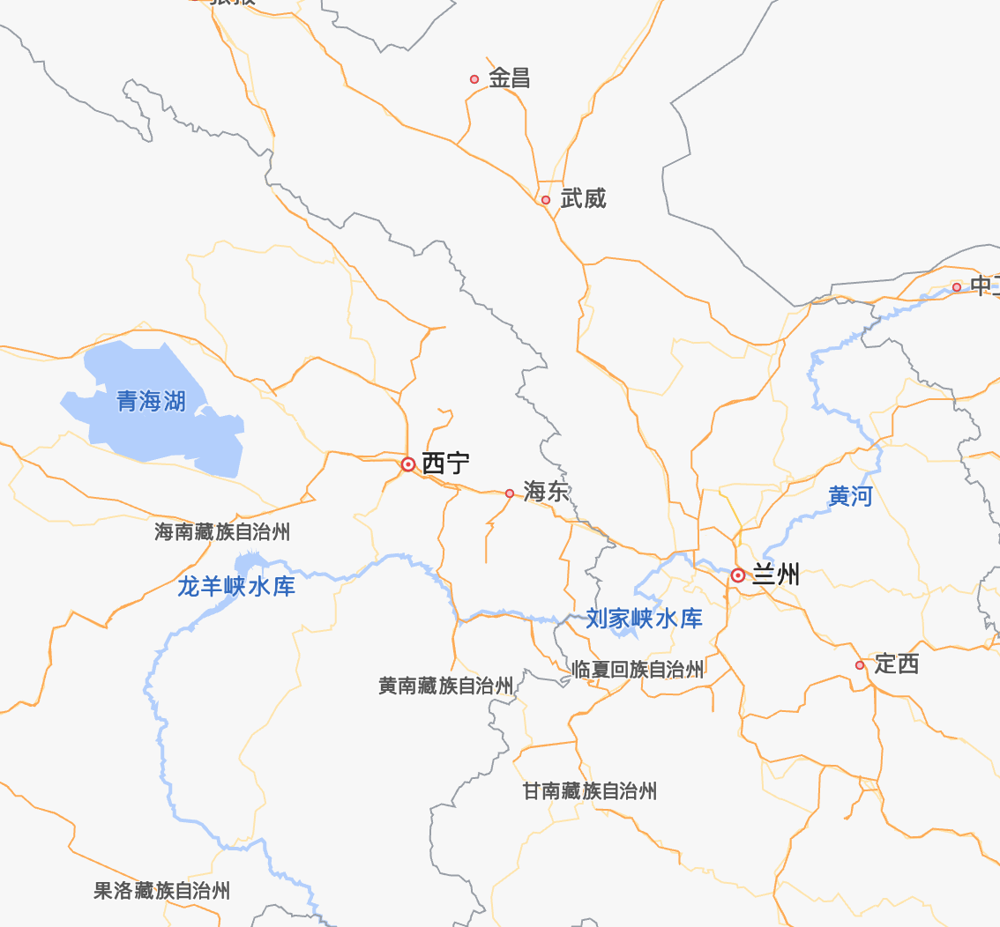
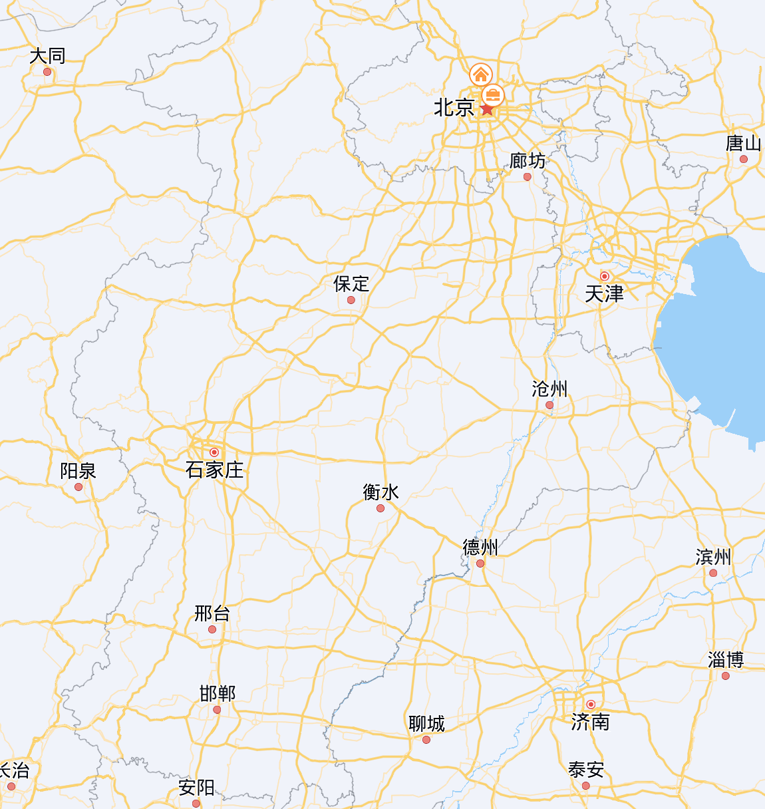
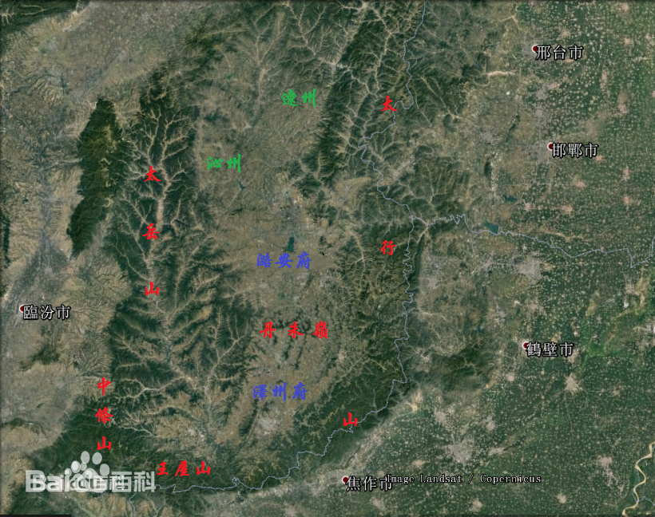
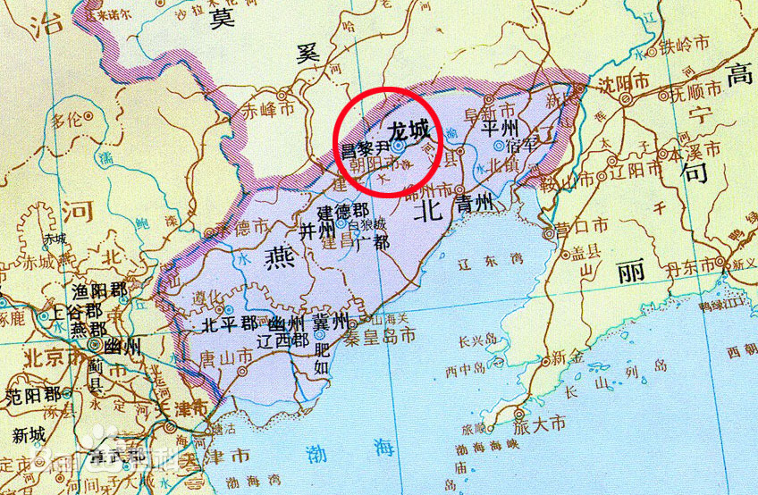
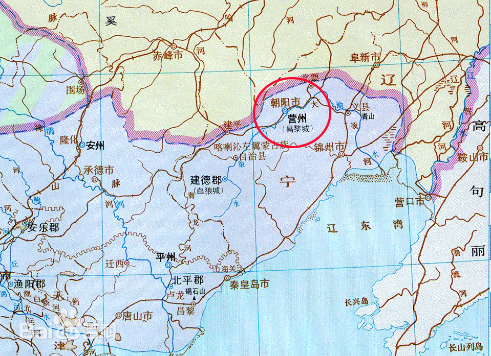

# 卷一百二十五 载记第二十五
# 乞伏国仁
`乞伏国仁`，`陇西`[1]`鲜卑`人也。在昔有`如弗`与`斯引`、`出连`、`叱卢`三部，自漠北南出`大阴山`，遇一巨虫于路，状若神龟，大如陵阜，乃杀马而祭之，祝曰："若善神也，便开路；恶神也，遂塞不通。"俄而不见，乃有一小儿在焉。时又有`乞伏`部有老父无子者，请养为子，众咸许之。老父欣然自以有所依凭，字之曰`纥干`。纥干者，夏言依倚也。年十岁，骁勇善骑射，弯弓五百斤。四部服其雄武，推为统主，号之曰`乞伏可汗` `托铎莫何`。托铎者，言非神非人之称也。其后有`祐邻`者，即`国仁`五世祖也。`泰始`初(西晋武帝司马炎第一个年号：265年-274年)，率户五千迁于`夏缘`，部众稍盛。`鲜卑` `鹿结`七万余落，屯于`高平川`，与`祐邻`迭相攻击。`鹿结`败，南奔`略阳`[2]，`祐邻`尽并其众，因居`高平川`。`祐邻`死，子`结权`立，徙于`牵屯`。`结权`死，子`利那`立，击`鲜卑` `吐赖`于`乌树山`，讨`尉迟渴权`于`大非川`，收众三万余落。`利那`死，弟`祁埿`立。`祁埿`死，`利那`子`述延`立。讨`鲜卑` `莫侯`于`苑川`[3]，大破之，降其众二万余落，因居`苑川`。以叔父`轲埿`为师傅，委以国政，`斯引乌埿`为左辅将军，镇`蔡园川`，`出连高胡`为右辅将军，镇`至便川`，`叱卢那胡`为率义将军，镇`牵屯山`。`述延`死，子`傉（nù）大寒`立。会`石勒`灭`刘曜`，惧而迁于`麦田` `旡（jì）孤山`。`大寒`死，子`司繁`立，始迁于`度坚山`。寻为`苻坚`将`王统`所袭，部众叛降于`统`。`司繁`叹谓左右曰："智不距敌，德不抚众，剑骑未交而本根已败，见众分散，势亦难全。若奔诸部，必不我容，吾将为`呼韩邪`之计矣。"乃诣`统`降于`坚`。`坚`大悦，署为南单于，留之`长安`。以`司繁`叔父`吐雷`为`勇士`护军，抚其部众。俄而`鲜卑` `勃寒`侵斥`陇`右，`坚`以`司繁`为使持节、都督讨西胡诸军事、镇西将军以讨之。`勃寒`惧而请降，`司繁`遂镇`勇士川`，甚有威惠。

>**[1] 陇西**: 就是陇山西部，陇山也叫六盘山，可以参考链接 [六盘山介绍](https://baike.baidu.com/tashuo/browse/content?id=f008437b0b41ffb1922d26c3&lemmaId=908786&fromLemmaModule=pcRight&lemmaTitle=%E5%85%AD%E7%9B%98%E5%B1%B1%E8%84%89&fromModule=lemma_right-tashuo-article)，可参考图片查看一下地形图。

>**[2] 略阳**：[略阳县](https://baike.baidu.com/item/%E7%95%A5%E9%98%B3%E5%8E%BF/8878135?fromModule=lemma_sense-layer#viewPageContent)，古县名。东汉建武八年（32），街泉县改置略阳县（治今甘肃秦安县陇城镇），属天水郡。见下图。

>**[3] 苑川**:[苑川](https://baike.baidu.com/item/%E8%8B%91%E5%B7%9D?fromModule=lemma_search-box)即今甘肃榆中大营川，汉在川内置牧师苑。东晋十六国时期为西秦政权的第二个都城。

　　`司繁`卒，`国仁`代镇，及`坚`兴`寿春`之役，征为前将军，领先锋骑。会`国仁`叔父`步颓`叛于`陇西`，`坚`遣`国仁`还讨之。`步颓`闻而大悦，迎`国仁`于路。`国仁`置酒高会，攘袂大言曰："`苻氏`往因`赵石`之乱，遂妄窃名号，穷兵极武，跨僭八州。疆宇既宁，宜绥以德，方虚广威声，勤心远略，骚动苍生，疲弊中国，违天怒人，将何以济！且物极则亏、祸盈而覆者，天之道也。以吾量之，是役也，难以免矣。当与诸君成一方之业。"及`坚`败归，乃招集诸部，有不附者，讨而并之，众至十余万。及`坚`为`姚苌`所杀，`国仁`谓其豪帅曰："`苻氏`以高世之姿而困于乌合之众，可谓天也。夫守常迷运，先达耻之；见机而作，英豪之举。吾虽薄德，藉累世之资，岂可睹时来之运而不作乎！"以`孝武`[4] `太元`十年自称大都督、大将军、大单于、领`秦`、`河`[5]二州牧，建元曰`建义`。以其将`乙旃音埿`为左相，`屋引出支`为右相，`独孤匹蹄`为左辅，`武群勇士`为右辅，弟`乾归`为上将军，自余拜授各有差。置`武城`、`武阳`、`安固`、`武始`、`汉阳`、`天水`、`略阳`、`漒川`、`甘松`、`匡朋`、`白马`、`苑川`十二郡，筑`勇士城`以居之。

>**[4] 孝武**：晋[孝武帝](https://baike.baidu.com/item/%E5%8F%B8%E9%A9%AC%E6%9B%9C/2669652?fromModule=search-result_lemma)司马曜（362年—396年11月6日），字昌明，东晋第九任皇帝（372年9月12日 —396年11月6日 在位）。晋简文帝司马昱第六子 ，母为李陵容。太元元年为公元376年。

>**[5] 秦、河州**：[秦州](https://baike.baidu.com/item/%E7%A7%A6%E5%B7%9E%E5%8C%BA?fromtitle=%E7%A7%A6%E5%B7%9E&fromid=806378&fromModule=lemma_search-box)主要是甘肃省天水市，[河州](https://baike.baidu.com/item/%E6%B2%B3%E5%B7%9E/3162068)主要是甘肃南部，指临夏地区，

　　`鲜卑` `匹兰`率众五千降。明年，`南安`[6] `秘宜`及诸羌虏来击`国仁`，四面而至。`国仁`谓诸将曰："先人有夺人之心，不可坐待其至。宜抑威饵敌，羸师以张之，军法所谓怒我而怠寇也。"于是勒众五千，袭其不意，大败之。`秘宜`奔还`南安`，寻与其弟`莫侯悌`率众三万余户降于`国仁`，各拜将军、刺史。

>**[6] 南安**：[南安](https://baike.baidu.com/item/%E5%8D%97%E5%AE%89/12021529?fromModule=lemma_sense-layer#viewPageContent)在前凉时属于河州，治所在枹罕【fú hǎn 】（今临夏）。

　　`苻登`遣使者署`国仁`使持节、大都督、都督杂夷诸军事、大将军、大单于、`苑川王`。`国仁`率骑三万袭`鲜卑`大人`密贵`、`裕苟`、`提伦`等三部于`六泉`。`高平` `鲜卑` `没奕于`、`东胡` `金熙`连兵来袭，相遇于`渴浑川`，大战败之，斩级三千，获马五千匹。`没奕于`及`熙`奔还，三部震惧，率众迎降。署`密贵`建义将军、`六泉侯`，`裕苟`建忠将军、`兰泉侯`，`提伦`建节将军、`鸣泉侯`。

　　`国仁`建威将军`叱卢乌孤跋`拥众叛，保`牵屯山`。`国仁`率骑七千讨之，斩其部将`叱罗侯`，降者千余户。`跋`大惧，遂降，复其官位。因讨`鲜卑` `越质叱黎`于`平襄`，大破之，获其子`诘归`、弟子`复半`及部落五千余人而还。

　　`太元`十三年，`国仁`死，在位四年，伪谥`宣烈王`，庙号`烈祖`。

# 乞伏乾归

　　`乾归`，`国仁`弟也。雄武英杰，沈雅有度量。`国仁`之死也，其群臣咸以`国仁`子`公府`冲幼，宜立长君，乃推`乾归`为大都督、大将军、大单于、`河南王`，赦其境内，改元曰`太初`。立其妻`边氏`为王后，以`出连乞都`为丞相，镇南将军、`南梁州`刺史`悌眷`为御史大夫，自余封拜各有差。遂迁于`金城`[7]。

>**[7] 金城**：今甘肃省会兰州市，地理位置如下图所示。

　　`太元`十四年，`苻登`遣使署`乾归`大将军、大单于、`金城王`。南`羌` `独如`率众七千降之。`休官` `阿敦`、`侯年`二部各拥五千余落，据`牵屯山`，为其边害。`乾归`讨破之，悉降其众，于是声振边服。`吐谷浑`大人`视连`遣使贡方物。`鲜卑` `豆留䩭`、`叱豆浑`及`南丘` `鹿结`并`休官` `曷呼奴`、`卢水` `尉地跋`并率众降于`乾归`，皆署其官爵。`陇西`太守`越质诘归`以`平襄`叛，自称建国将军、右贤王。`乾归`击败之，`诘归`东奔`陇山`。既而拥众来降，`乾归`妻以宗女，署立义将军。

　　`苻登`将`没奕于`遣使结好，以二子为质，请讨`鲜卑` `大兜国`。`乾归`乃与`没奕于`攻`大兜`于`安阳城`，`大兜`退固`鸣蝉堡`，`乾归`攻陷之，遂还`金城`。为`吕光`弟`宝`所攻，败于`鸣雀峡`，退屯`青岸`。`宝`进追`乾归`，`乾归`使其将`彭奚念`断其归路，躬贯甲胄，连战败之，`宝`及将士投河死者万余人。

　　`苻登`遣使署`乾归`假黄钺、大都督`陇`右`河`西诸军事、左丞相、大将军、`河南王`，领`秦`、`梁`、`益`、`凉`、`沙`[8]五州牧，加九锡之礼。时`登`为`姚兴`所逼，遣使请兵，进封`乾归` `梁王`，命置官司，纳其妹`东平长公主`为`梁王`后。`乾归`遣其前将军`乞伏益州`、冠军`翟瑥`率骑二万救之。会`登`为`兴`所杀，乃还师。

>**[8] 五州**:秦，梁，益，凉，沙五州。**秦州**：治所在今甘肃省天水市。**梁州**：是《禹贡》古九州之一，代指陕西、四川盆地、汉中及部分云贵地区。明代洪武帝认为“中国之旧疆”包括陕西、巴蜀（明代四川省）及云南在内。。**益州**：中国古地名，汉武帝设置的十三州（十三刺史部）之一，其最大范围（三国时期）包含今四川，重庆，云南，贵州，汉中大部分地区及缅甸北部，湖北、河南小部分，治所在蜀郡的成都。**凉州**：治所在今甘肃省武威市，古称凉州、姑臧、雍州。**沙州**：古代行政区划，十六国前凉置沙州，治所在今敦煌，辖敦煌、晋昌、高昌三郡和西域都护、戊己校尉、玉门大护军三营，治所在今甘肃省敦煌市。

　　`氐王` `杨定`率步骑四万伐之。`乾归`谓诸将曰："`杨定`以勇虐聚众，穷兵逞欲。兵犹火也，不戢，将自焚。`定`之此役，殆天以之资我也。"于是遣其`凉州`牧`乞伏轲殚`、`秦州`牧`乞伏益州`、立义将军`诘归`距之。`定`败`益州`于`平川`，`轲殚`、`诘归`引众而退。`翟瑥`奋剑谏曰："吾王以神武之姿，开基`陇`右，东征西讨，靡不席卷，威震`秦`、`梁`，声光`巴`、`汉`。将军以维城之重，受阃外之寄，宜宣力致命，辅宁家国。`秦州`虽败，二军犹全，奈何不思直救，便逆奔败，何面目以见王乎！昔`项羽`斩`庆子`以宁`楚`，`胡建`[9]戮监军以成功，将军之所闻也。`瑥`诚才非古人，敢忘`项氏`之义乎！"`轲殚`曰："向所以未赴`秦州`者，未知众心何如耳。败不相救，军罚所先，敢自宁乎！"乃率骑赴之。`益州`、`诘归`亦勒众而进，大败`定`，斩`定`及首虏万七千级。于是尽有`陇西`、`巴西`之地。

>**[9] 胡建**：详见《汉书胡建传》，可查看词条：[胡建斩监军御史案](https://baike.baidu.com/item/%E8%83%A1%E5%BB%BA%E6%96%A9%E7%9B%91%E5%86%9B%E5%BE%A1%E5%8F%B2%E6%A1%88/49973133)。

　　`太元`十七年，赦其境内殊死以下，署其长子`炽磐`领尚书令，左长史`边芮`为尚书左仆射，右长史`秘宜`为右仆射，`翟瑥`为吏部尚书，`翟勍`为主客尚书，`杜宣`为兵部尚书，`王松寿`为民部尚书，`樊谦`为三公尚书，`方弘`、`麹景`为侍中，自余拜授一如`魏武`、`晋文`故事。犹称大单于、大将军。

　　`杨定`之死也，`天水` `姜乳`袭据`上邽`[10]。至是，遣`乞伏益州`讨之。`边芮`、`王松寿`言于`乾归`曰："`益州`以懿弟之亲，屡有战功，狃于累胜，常有骄色。若其遇寇，必将易之。且未宜专任，示有所先。"`乾归`曰："`益州`骁勇，善御众，诸将莫有及之者，但恐其专擅耳。若以重佐辅之，当无虑也。"于是以平北`韦虔`为长史、散骑常侍`务和`为司马。至`大寒岭`，`益州`恃胜自矜，不为部阵，命将士解甲游畋纵饮，令曰："敢言军事者斩！"`虔`等谏曰："王以将军亲重，故委以专征之任，庶能摧彼凶丑，以副具瞻。贼已垂逼，奈何解甲自宽，宴安鸩毒，窃为将军危之。"`益州`曰："`乳`以乌合之众，闻吾至，理应远窜。今乃与吾决战者，斯成擒也。吾自揣之有方，卿等不足虑也。"`乳`率众距战，`益州`果败。`乾归`曰："孤违`蹇叔`，以至于此。将士何为，孤之罪也。"皆赦之。

>**[10] 上邽**：位于今甘肃省天水市清水县，详见词条：[上邽](https://baike.baidu.com/item/%E4%B8%8A%E9%82%BD?fromModule=lemma_search-box)。

　　索虏`秃发如苟`，率户二万降之，`乾归`妻以宗女。

　　`吕光`率众十万将伐`乾归`，左辅`密贵周`、左卫`莫者羖羝`言于`乾归`曰："`光`旦夕将至。陛下以命世雄姿，开业`洮` `罕`，克翦群凶，威振遐迩，将鼓淳风于东夏，建八百之鸿庆。不忍小屈，与奸竖竞于一时，若机事不捷，非国家利也。宜遣爱子以退之。"`乾归`乃称藩于`光`，遣子`敕勃`为质。既而悔之，遂诛`周`等。

　　`乞伏轲殚`与`乞伏益州`不平，奔于`吕光`。`光`又伐之，咸劝其东奔`成纪`[11]，`乾归`不从，谓诸将曰："昔`曹孟德`败`袁本初`于`官渡`[12]，`陆伯言`摧`刘玄德`于`白帝`[13]，皆以权略取之，岂在众乎！`光`虽举全州之军，而无经远之算，不足惮也。且其精卒尽在`吕延`，`延`虽勇而愚，易以奇策制之。`延`军若败，`光`亦遁还，乘胜追奔，可以得志。"众咸曰："非所及也。"`隆安`元年[14]，`光`遣其子`纂`伐`乾归`，使`吕延`为前锋。`乾归`泣谓众曰："今事势穷踧，逃命无所，死中求生，正在今日。`凉`军虽四面而至，然相去辽远，山河既阻，力不周接，败其一军而众军自退。"乃纵反间，称`秦王` `乾归`众溃，东奔`成纪`。`延`信之，引师轻进，果为`乾归`所败，遂斩之。

>**[11] 成纪**：[成纪县](https://baike.baidu.com/item/%E6%88%90%E7%BA%AA%E5%8E%BF?fromtitle=%E6%88%90%E7%BA%AA&fromid=6555802&fromModule=lemma_search-box)，是中国古代的一个县，其址历史上曾有迁移，但是都在甘肃省东南部，县治始终处于天水市秦安县叶堡一带。

>**[12] 官渡**：官渡，位于河南省中牟县，黄河之南，是从河北进军河南地界的军事要冲之地，因为发生了震惊天下的官渡大战而闻名。在河南郑州市中牟县城东北2.5公里官渡镇一带。

>**[13] 白帝**：[白帝城](https://baike.baidu.com/item/%E7%99%BD%E5%B8%9D%E5%9F%8E/25893?fromModule=lemma_search-box)，位于重庆市奉节县白帝镇白帝村1号社，地处瞿塘峡口长江北岸，白帝山上，东望夔门，南与白盐山隔江相望，西临奉节县城，北倚鸡公山，地处长江三峡（长江三峡西起重庆奉节白帝城，东至湖北宜昌南津关）西端入口。

>**[14] 隆安**：[隆安](https://baike.baidu.com/item/%E9%9A%86%E5%AE%89/3399180?fromModule=lemma_sense-layer#viewPageContent)（或作崇安；397年-401年）是东晋皇帝晋安帝司马德宗的第一个年号，共计5年。隆安在一些古籍中又写作“崇安”，这是为了避讳唐玄宗李隆基的名字而改称。元兴元年三月复改隆安年号，随后又改大亨。

　　`秃发乌孤`遣使来结和亲。使`乞伏益州`攻克`支阳`、`鹯武`、`允吾`三城，俘获万余人而还。又遣`益州`与武卫`慕容允`、冠军`翟瑥`率骑二万伐`吐谷浑` `视罴`，至于`度周川`，大破之。`视罴`遁保`白兰山`，遣使谢罪，贡其方物，以子`宕岂`为质。`鲜卑` `叠掘河内`率户五千，自`魏`降`乾归`。

　　`乾归`所居`南景门`崩，恶之，遂迁于`苑川`。`姚兴`将`姚硕德`率众五万伐之，入自`南安峡`。`乾归`次于`陇西`以距`硕德`。`兴`潜师继发。`乾归`闻`兴`将到，谓诸将曰："吾自开建以来，屡摧勍敌，乘机籍算，举无遗策。今`姚兴`尽中国之师，军势甚盛。山川阻狭，无纵骑之地，宜引师平川，伺其怠而击之。存亡之机，在斯一举，卿等戮力勉之。若枭翦`姚兴`，关中之地尽吾有也。"于是遣其卫军`慕容允`率中军二万迁于`柏阳`，镇军`罗敦`将外军四万迁于`侯辰谷`，`乾归`自率轻骑数千候`兴`军势。俄而大风昏雾，遂与中军相失，为`兴`追骑所逼，入于外军。旦而交战，为`兴`所败。`乾归`遁还`苑川`，遂走`金城`，谓诸豪帅曰："吾才非命世，谬为诸君所推，心存拨乱，而德非时雄，叨窃名器，年逾一纪，负乘致寇，倾丧若斯！今人众已散，势不得安，吾欲西保`允吾`，以避其锋。若方轨西迈，理难俱济，卿等宜安土降`秦`，保全妻子。"群下咸曰："昔`古公`杖策，`豳`人归怀；`玄德`南奔，`荆`、`楚`襁负。分岐之感，古人所悲，况臣等义深父子，而有心离背！请死生与陛下俱。"`乾归`曰："自古无不亡之国，废兴命也。苟天未亡我，冀兴复有期。德之不建，何为俱死！公等自爱，吾将寄食以终余年。"于是大哭而别，乃率骑数百驰至`允吾`，`秃发利鹿孤`遣弟`傉檀`迎`乾归`，处之于`晋兴`。

　　`南羌` `梁戈`等遣使招之。`乾归`将叛，谋泄，`利鹿孤`遣弟`吐雷`屯于`扪天岭`。`乾归`惧为`利鹿孤`所害，谓其子`炽磐`曰："吾不能负荷大业，致兹颠覆。以`利鹿孤`义兼姻好，冀存唇齿之援，方乃忘义背亲，谋人父子，忌吾威名，势不全立。`姚兴`方盛，吾将归之。若其俱去，必为追骑所及。今送汝兄弟及汝母为质，彼必不疑。吾既在`秦`，终不害汝。"于是送`炽磐`兄弟于`西平`，`乾归`遂奔`长安`。`姚兴`见而大悦，署`乾归`持节、都督`河`南诸军事、镇远将军、`河州`刺史、归义侯，遣`乾归`还镇`苑川`，尽以部众配之。`乾归`既至`苑川`，以`边芮`为长史，`王松寿`为司马，公卿大将已下悉降号为偏裨。

　　`元兴`元年[15]，`炽磐`自`西平`奔`长安`，`姚兴`以为振忠将军、`兴晋`太守。寻遣使者加`乾归`散骑常侍、左贤王。遣随`兴`将`齐难`迎`吕隆`于`河`西，讨叛`羌` `党龙头`于`滋川`，攻`杨盛`将`苻帛`于`皮氏堡`，并克之。又破`吐谷浑`将`大孩`，俘获万余人而还。寻复率众攻`杨盛`将`杨玉`于`西阳堡`，克之。既而`苑川`地震裂生毛，狐雉入于寝内，`乾归`甚恶之。`姚兴`虑`乾归`终为西州之患，因其朝也，`兴`留为主客尚书，以`炽磐`为建武将军、行西夷校尉，监抚其众。

>**[15] 元兴**：[元兴](https://baike.baidu.com/item/元兴/3183292?fromModule=lemma_sense-layer#viewPageContent)（402年-404年），是东晋皇帝晋安帝司马德宗的第二个年号，共计使用3年。

　　`炽磐`以`长安`兵乱将始，乃招结诸部二万七千，筑城于`嵻㟍山`以据之。`炽磐`攻克`枹罕`，遣使告之，`乾归`奔还`苑川`。`鲜卑` `悦大坚`有众五千，自`龙马苑`降`乾归`。`乾归`遂如`枹罕`，留`炽磐`镇之。`乾归`收众三万，迁于`度坚山`。群下劝`乾归`称王，`乾归`以寡弱弗许。固请曰："夫道应符历，虽废必兴；图箓所弃，虽成必败。`本初`之众，非不多也，`魏武`运筹，四州瓦解。`寻`、`邑`之兵，非不盛也，`世祖`龙申，亡`新`鸟散。固天命不可虚邀，符箓不可妄冀。`姚`数将终，否极斯泰，乘机抚运，实系圣人。今见众三万，足可以疆理`秦`、`陇`，清荡`洮` `河`。陛下应运再兴，四海鹄望，岂宜固守谦冲，不以社稷为本！愿时即大位，允副群心。"`乾归`从之。`义熙`三年[16]，僭称`秦王`，赦其境内，改元`更始`，置百官，公卿已下皆复本位。

>**[16] 义熙**：[义熙](https://baike.baidu.com/item/义熙/8884?structureClickId=8884&structureId=cbfa87f1f214eee383e2e3bb&structureItemId=954bc47ea633fa8666d5a007&lemmaFrom=starMapContent_star&fromModule=starMap_content&lemmaIdFrom=3183292)（405年-418年）是东晋皇帝晋安帝司马德宗的第四个年号，共计14年。405年刘裕攻桓玄，营救安帝，将他重新设立为东晋皇帝，改元。

　　遣`炽磐`讨谕`薄地延`，师次`烦于`，`地延`率众出降，署为尚书，徙其部落于`苑川`。又遣`陇西` `羌` `昌何`攻克`姚兴` `金城郡`，以其骁骑`乞伏务和`为`东金城太守`。`乾归`复都`苑川`，又攻克`兴` `略阳`、`南安`、`陇西`诸郡，徙二万五千户于`苑川`、`枹罕`。`姚兴`力未能西讨，恐更为边害，遣使署`乾归`使持节、散骑常侍、都督`陇西`岭北`匈奴`杂胡诸军事、征西大将军、`河州`牧、大单于、`河南王`。`乾归`方图`河`右，权宜受之，遂称藩于`兴`。

　　遣`炽磐`与其次子中军`审虔`率步骑一万伐`秃发傉檀`，师济`河`，败`傉檀`太子`武台`于岭南，获牛马十余万而还。又攻克`兴`别将`姚龙`于`伯阳堡`，`王憬`于`永洛城`，徙四千余户于`苑川`，三千余户于`谭郊`。`乾归`率步骑三万征西`羌` `彭利发`于`枹罕`，师次于`奴葵谷`，`利发`弃其部众南奔。`乾归`遣其将`公府`追及于`清水`，斩之。`乾归`入`枹罕`，收`羌`户一万三千。因率骑二万讨`吐谷浑`支统`阿若干`于`赤水`，大破降之。

　　`乾归`畋于`五溪`，有枭集于其手，甚恶之。六年，为兄子`公府`所弑，并其诸子十余人。`公府`奔固`大夏`，`炽磐`与`乾归`弟广武`智达`、扬武`木奕于`讨之。`公府`走，`达`等追擒于`嵻㟍` `南山`，并其四子，轘之于`谭郊`。葬`乾归`于`枹罕`，伪谥武元王，在位二十四年。

# 乞伏炽磐
　　`炽磐`，`乾归`长子也。性勇果英毅，临机能断，权略过人。初，`乾归`为`姚兴`所败，`炽磐`质于`秃发利鹿孤`。后自`西平`逃而降`兴`，`兴`以为振忠将军、`兴晋`太守，又拜建武将军、行西夷校尉，留其众镇`苑川`。及`乾归`返政，复立`炽磐`为太子，领冠军大将军、都督中外诸军、录尚书事。后`乾归`称藩于`姚兴`，`兴`遣使署`炽磐`假节、镇西将军、左贤王、`平昌公`，寻进号抚军大将军。

　　`乾归`死，`义熙`六年，`炽磐`袭伪位，大赦，改元曰`永康`。署`翟勍`为相国，`麹景`为御史大夫，`段晖`为中尉，弟`延祚`为禁中录事，`樊谦`为司直。罢尚书令、仆射、尚书、六卿、侍中、散骑常侍、黄门郎官，置中左右常侍、侍郎各三人。

　　`义熙`九年，遣其龙骧`乞伏智达`、平东`王松寿`讨`吐谷浑` `树洛干`于`浇河`[17]，大破之，获其将`呼那乌提`，虏三千余户而还。又遣其镇东`昙达`与`松寿`率骑一万，东讨破`休官` `权小郎`、`吕破胡`于`白石川`，虏其男女万余口，进据`白石城`，休官降者万余人。后`显亲` `休官` `权小成`、`吕奴迦`等叛保`白坑`，`昙达`谓将士曰："昔`伯珪`[18]凭险，卒有灭宗之祸；`韩约`[19]肆暴，终受覆族之诛。今`小成`等逆命`白坑`，宜在除灭。王者之师，有征无战，粤尔舆人，戮力勉之！"众咸拔剑大呼，于是进攻`白坑`，斩`小成`、`奴迦`及首级四千七百，`陇`右`休官`悉降。遣安北`乌地延`、冠军`翟绍`讨`吐谷浑`别统`句旁`于`泣勤川`，大破之，俘获甚众。`炽磐`率诸将讨`吐谷浑`别统`支旁`于`长柳川`，`掘达`于`渴浑川`，皆破之，前后俘获男女二万八千。

>**[17] 浇河**：[浇河](https://baike.baidu.com/item/浇河?fromModule=lemma_search-box)，城、郡名。东晋末吐谷浑筑城，故址在今青海黄河南岸贵德县境。

>**[18] 伯珪**：[公孙瓒](https://baike.baidu.com/item/公孙瓒/18169?fromModule=search-result_lemma)（？—199年），字伯圭（一作伯珪），辽西令支（今河北迁安）人，东汉末年武将、军阀，汉末群雄之一。

>**[19] 韩遂**：[韩遂](https://baike.baidu.com/item/韩遂/1176067?fromtitle=韩约&fromid=15495509)（？－215年），原名韩约，字文约，凉州金城郡（今甘肃省兰州市）人。东汉末年军阀、将领，汉末群雄之一。

　　僭立三年，有云五色，起于南山，`炽磐`以为己瑞，大悦，谓群臣曰："吾今年应有所定，王业成矣！"于是缮甲整兵，以待四方之隙。闻`秃发辱檀`西征`乙弗`，投剑而起曰："可以行矣！"率步骑二万袭`乐都`[20]。`秃发武台`凭城距守，`炽磐`攻之，一旬而克。遂入`乐都`，论功行赏各有差。遣平远`犍虔`率骑五千追`傉檀`，徙`武台`与其文武及百姓万余户于`枹罕`。`傉檀`遂降，署为骠骑大将军、`左南公`。随`傉檀`文武，依才铨擢之。`炽磐`既兼`傉檀`，兵强地广，置百官，立其妻`秃发氏`为王后。

>**[20] 乐都**：即今[乐都区](https://baike.baidu.com/item/乐都区?fromtitle=乐都&fromid=5164767&fromModule=lemma_search-box)，隶属青海省海东市。是海东市政府所在地。

　　十一年，`炽磐`攻克`沮渠蒙逊` `湟河`太守`沮渠汉平`，以其左卫`匹逵`为`湟河`太守，因讨降`乙弗窟乾`而还。遣其将`昙达`、`王松寿`等讨南`羌` `弥姐康薄`于`赤水`，降之。

　　`炽磐`攻`漒川`，师次`沓中`，`沮渠蒙逊`率众攻`石泉`以救之。`炽磐`闻而引还，遣`昙达`与其将`出连虔`率骑五千赴之。`蒙逊`闻`昙达`至，引归，遣使聘于`炽磐`，遂结和亲。又遣`昙达`、`王松寿`等率骑一万伐`姚艾`于`上邽`。`昙达`进据`蒲水`，`艾`距战，大败之，`艾`奔`上邽`。`昙达`进屯`大利`，破`黄石`、`大羌`二戍，徙五千余户于`枹罕`。

　　令其安东`木奕于`率骑七千讨`吐谷浑` `树洛干`于塞上，破其弟`阿柴`于`尧扞川`，俘获五千余口而还，`洛干`奔保`白兰山`而死。`炽磐`闻而喜曰："此虏矫矫，所谓有豕白蹢[21]。往岁`昙达`东征，`姚艾`败走；今`木奕于`西讨，黠虏远逃。境宇稍清，奸凶方殄，股肱惟良，吾无患矣。"于是以`昙达`为左丞相，其子`元基`为右丞相，`麹景`为尚书令，`翟绍`为左仆射。遣`昙达`、`元基`东讨`姚艾`，降之。

>**[21] 有豕白蹢**：出自[《诗经·小雅·渐渐之石》](https://baike.baidu.com/item/小雅·渐渐之石/2036491)，意思是“有猪长着白蹄”。‌

　　至是，`乙弗鲜卑` `乌地延`率户二万降于`炽磐`，署为建义将军。`地延`寻死，弟`他子`立，以子`轲兰`质于`西平`。`他子`从弟`提孤`等率户五千以西迁，叛于`炽磐`。`凉州`刺史`出连虔`遣使喻之，`提孤`等归降。`炽磐`以`提孤`奸猾，终为边患，税其部中戎马六万匹。后二岁而`提孤`等扇动部落，西奔出塞。`他子`率户五千入居`西平`。

　　先是，`姚艾`叛降`蒙逊`，`蒙逊`率众迎之。`艾`叔父`俊`言于众曰："`秦王`宽仁有雅度，自可安土事之，何为从`凉`主西迁？"众咸以为然，相率逐`艾`，推`俊`为主，遣使请降。`炽磐`大悦，征`俊`为侍中、中书监、征南将军，封`陇西公`，邑一千户。

　　使征西`孔子`讨`吐谷浑` `觅地`于`弱水`[22]南，大破之。觅地率众六千降于炽磐，署为弱水护军。遣其左卫匹逵，建威梯君等讨彭利和于漒川，大破之，利和单骑奔仇池，获其妻子。徙羌豪三千户于枹罕，漒川羌三万余户皆安堵如故。

>**[22] 弱水**：[黑河](https://baike.baidu.com/item/黑河/12797121?fromtitle=弱水&fromid=83148)，古弱水（合黎山以北段）、黑水（一般指弱水下游黑河内蒙古段）。曾名合黎水、羌谷水、鲜水、覆表水、副投水、张掖水、甘州河。是中国西北地区第二大内陆河，甘肃省最大的内陆河。发源于祁连山北麓中段，流经青海、甘肃、内蒙古自治区三省（自治区）。下游称弱水（古弱水）。其中内蒙古境内河段称额济纳旗河（额济纳河，西夏语黑水），在居延海消失。

　　`元熙`元年[23]，立其第二子`慕末`为太子，领抚军大将军、都督中外诸军事，大赦境内，改元曰`建弘`，其臣佐等多所封授。`炽磐`在位七年而`宋氏`受禅，以`宋` `元嘉`四年[24]死。子`慕末`嗣伪位，在位四年，为`赫连定`所杀。

>**[23] 元熙**：[元熙](https://baike.baidu.com/item/元熙/8885?fromModule=lemma_sense-layer#viewPageContent)（419年-420年六月），是东晋皇帝晋恭帝司马德文的年号，也是东晋王朝的最后一个年号。

**[24] 元嘉**：[元嘉](https://baike.baidu.com/item/元嘉/3223047)（424年—453年）是南朝宋皇帝宋文帝刘义隆的年号，共计29年余。

　　始`国仁`以`孝武` `太元`[25]十年僭位，至`慕末`四世，凡四十有六载而灭。

>**[25] 太元**：[太元](https://baike.baidu.com/item/太元/3317946)（376年-396年）是东晋孝武帝司马曜的第二个年号，共计21年。 太元二十一年九月晋安帝即位沿用，次年改元隆安元年。

```
西秦世系图：
* 乞伏纥干
  * 祐邻
    * 结权
      * 利那
        * 述延
          * 傉大寒
            * 司繁
              * 国仁（？～388年）
              * 乾归（？～412年）
                * 炽磐（？~427年或428年）
                  * 慕末（？～431年）
                * 敕勃
                * 审虔
              * 智达
            * 步颓
          * 吐雷
      * 祁埿 
      * 轲埿 
```

　　史臣曰：夫天地闭，大祲生；云雷屯，群凶作。自晋室遘孽，胡兵肆祸，封域无纪，干戈是务。`国仁` `阴山`遗噍，难以义服，伺我阽危，长其陵暴。向使偶钦明之运，遭雄略之主，已当褫魂沙漠，请命`藁街`[26]，岂暇窃据近郊，经纶王业者也。

>**[26] 藁街**：[稾街](https://baike.baidu.com/item/稾街?fromtitle=藁街&fromid=8530045&fromModule=lemma_search-box)为汉长安街名，乃其时外国使节或宾客所居之处，犹今日之使馆区也。

　　`乾归`智不及远而以力诈自矜。陷`吕延`之师，奸谋潜断；俘`视罴`之众，威策遐举。便欲誓`汧`、`陇`之余卒，窥`崤`、`函`之奥区，秣疲马而宵征，翦勍敌而朝食。既而控弦鸣镝，厥志未逞，沮岸崩山，其功已丧。履重氛于外难，幸以计全；贻巨衅于萧墙，终成凶祸，宜哉！

　　`炽磐`叱咤风云，见机而动，牢笼俊杰，决胜多奇，故能命将掩`浇河`之酋，临戎袭`乐都`之地，不盈数载，遂隆伪业。览其遗迹，盗亦有道乎！

# 冯跋
　　`冯跋`，字`文起`，`长乐` `信都`[27]人也，小字`乞直伐`，其先`毕万`之后也。`万`之子孙有食采`冯乡`者，因以氏焉。`永嘉`之乱[28]，`跋`祖父`和`避地`上党`[29]。父`安`，雄武有器量，`慕容永`时为将军。`永`灭，`跋`东徙`和龙`[30]，家于`长谷`。幼而懿重少言，宽仁有大度，饮酒一石不乱。三弟皆任侠，不修行业，惟`跋`恭慎，勤于家产，父母器之。所居上每有云气若楼阁，时咸异之。尝夜见天门开，神光赫然烛于庭内。及`慕容宝`僭号，署中卫将军。

>**[27] 信都**：[信都](https://baike.baidu.com/item/信都/24163335?fromModule=lemma_sense-layer#viewPageContent)是历史行政区域，河北衡水冀州区旧称。后续名称冀州、冀县、冀州市、冀州区。太康五年（284年）安平国改为长乐国。长乐国的治所仍在信都（今冀州区旧城），辖区和现冀州区境内设置的两个县都没有变化。

>**[28] 永嘉之乱**：[永嘉之乱](https://baike.baidu.com/item/永嘉之乱?fromModule=lemma_search-box)，是西晋怀帝永嘉五年（311年），匈奴军队在刘渊之子刘聪率领下击败西晋京师洛阳的守军，攻陷洛阳并大肆抢掠杀戮，更俘虏晋怀帝等王公大臣的一场乱事。及后导致西晋于316年灭亡。

>**[29] 上党**：[上党郡](https://baike.baidu.com/item/上党郡/3361793?fromtitle=上党&fromid=23729273#viewPageContent)，是山西东南部古地名。包括清代山西省下辖的辽州、沁州二州与潞安府、泽州府两府。也即晋中市东南部的榆社、左权一带和长治、晋城两市，它是由群山包围起来的一块高地。

>**[30] 和龙**：[龙城](https://baike.baidu.com/item/龙城/13022561?fromtitle=和龙&fromid=55222039#viewPageContent)，古城名。亦称“和龙城”、“黄龙城”、“龙都”。故址在今辽宁朝阳。龙城是十六国时期鲜卑族建造的都城。鲜卑族慕容氏建立的前燕、后燕和冯氏建立的北燕，这三个封建割据王朝，均以龙城为都，统称“三燕”，前后达百年之久。

　　初，`跋`弟`素弗`与从兄`万泥`及诸少年游于水滨，有一金龙浮水而下，`素弗`谓`万泥`曰："颇有见否？"`万泥`等皆曰："无所见也。"乃取龙而示之，咸以为非常之瑞。`慕容熙`闻而求焉，`素弗`秘之，`熙`怒。及即伪位，密欲诛`跋`兄弟。其后`跋`又犯`熙`禁，惧祸，乃与其诸弟逃于山泽。每夜独行，猛兽常为避路。时赋役繁数，人不堪命，`跋`兄弟谋曰："`熙`今昏虐，兼忌吾兄弟，既还首无路，不可坐受诛灭。当及时而起，立公侯之业。事若不成，死其晚乎！"遂与`万泥`等二十二人结谋。`跋`与二弟乘车，使妇人御，潜入`龙城`，匿于北部司马`孙护`之室。遂杀`熙`，立`高云`为主。`云`署`跋`为使持节、侍中、都督中外诸军事、征北大将军、开府仪同三司、录尚书事、`武邑公`。

　　`跋`宴群僚，忽有血流其左臂，`跋`恶之。从事中郎`王垂`因说符命之应，`跋`戒其勿言。`云`为其幸臣`离班`、`桃仁`所杀，`跋`升`洪光门`以观变。帐下督`张泰`、`李桑`谓`跋`曰："此竖势何所至！请为公斩之。"于是奋剑而下，`桑`斩`班`于西门，`泰`杀`仁`于庭中。众推`跋`为主，`跋`曰："`范阳公` `素弗`才略不恒，志于靖乱，扫清凶桀，皆公勋也。"`素弗`辞曰："臣闻父兄之有天下，传之于子弟，未闻子弟籍父兄之业而先之。今鸿基未建，危甚缀旒，天工无旷，业系大兄。愿上顺皇天之命，下副元元之心。"群臣固请，乃许之，于是以`太元`二十年乃僭称天王于`昌黎`[31]，而不徙旧号，即国曰`燕`，赦其境内，建元曰`太平`。分遣使者巡行郡国，观察风俗。追尊祖`和`为`元皇帝`，父`安`为`宣皇帝`，尊母`张氏`为太后，立妻`孙氏`为王后，子`永`为太子。署弟`素弗`为侍中、车骑大将军、录尚书事，`弘`为侍中、征东大将军、尚书右仆射、`汲郡公`，从兄`万泥`为骠骑大将军、`幽` `平`二州牧，`务银提`为上大将军、`辽东`太守，`孙护`为侍中、尚书令、`阳平公`，`张兴`为卫将军、尚书左仆射、`永宁公`，`郭生`为镇东大将军、领右卫将军、`陈留公`，从兄子`乳陈`为征西大将军、`并` `青`二州牧、`上谷公`，`姚昭`为镇南大将军、司隶校尉、`上党公`，`马弗勤`为吏部尚书、`广宗公`，`王难`为侍中、抚军将军、`颍川公`，自余拜授，文武进位各有差。寻而`万泥`抗表请代，`跋`曰："猥以不德，谬为群贤所推，思与兄弟同兹休戚。今方难未宁，维城任重，非明德懿亲，孰克居也！且折冲御侮，为国藩屏，虽有他人，不如我弟兄，岂得如所陈也。"于是加开府仪同三司。

>**[31] 昌黎**：[昌黎](https://baike.baidu.com/item/昌黎/19328568?fromModule=lemma_sense-layer#viewPageContent)，历史地名。故地位于今辽西一带。汉朝时期始置昌黎县，位于今辽宁义县境内。三国时期置昌黎郡。十六国时期昌黎郡迁治龙城县，位于今辽宁朝阳。北魏时期沿置昌黎郡隶属营州。隋朝时期废昌黎郡。唐朝时期置昌黎县于崇州，位于今辽宁朝阳市西南，后废。

　　`义熙`六年，`跋`下书曰："昔高祖为义帝举哀，天下归其仁。吾与`高云`义则君臣，恩逾兄弟。其以礼葬`云`及其妻子，立`云`庙于`韮町`，置园邑二十家，四时供荐。"

　　初，`跋`之立也，`万泥`、`乳陈`自以亲而有大功，谓当入为公辅，`跋`以二藩任重，因而弗征，并有憾焉。`乳陈`性粗犷，勇气过人，密遣告`万泥`曰："`乳陈`有至谋，顾与叔父图之。"`万泥`遂奔`白狼`，阻兵以叛。`跋`遣`冯弘`与将军`张兴`将步骑二万讨之。`弘`遣使喻之曰："昔者兄弟乘风云之运，抚翼而起。群公以天命所钟，人望攸系，推逼主上光践宝位。裂土疏爵，当与兄弟共之，奈何欲寻干戈于萧墙，弃友于而为`阏伯`[32]！过贵能改，善莫大焉。宜舍兹嫌，同奖王室。"`万泥`欲降，`乳陈`按剑怒曰："大丈夫死生有命，决之于今，何谓降也。"遂克期出战。`兴`谓`弘`曰："贼明日出战，今夜必来惊我营，宜命三军以备不虞。"`弘`乃密严人课草十束，畜火伏兵以待之。是夜，`乳陈`果遣壮士千余人来斫营。众火俱起，伏兵邀击，俘斩无遗。`乳陈`等惧而出降，`弘`皆斩之。

>**[32] 阏伯**：《春秋左传·昭公元年》昔高辛氏有二子，伯曰阏伯，季曰[实沈](https://baike.baidu.com/item/实沈/13678751?fromModule=search-result_lemma)，居于旷林，不相能也。日寻干戈，以相征讨。

　　署`素弗`为大司马，改封`辽西公`，`冯弘`为骠骑大将军，改封`中山公`。

　　`跋`下书曰："自顷多故，事难相寻，赋役繁苦，百姓困穷。宜加宽宥，务从简易，前朝苛政，皆悉除之。守宰当垂仁惠，无得侵害百姓，兰台都官明加澄察。"初，`慕容熙`之败也，工人`李训`窃宝而逃，赀至巨万，行货于`马弗勤`，`弗勤`以`训`为`方略`令。既而失志之士书之于阙下碑，`冯素弗`言之于`跋`，请免`弗勤`官，仍推罪之。`跋`曰："大臣无忠清之节，货财公行于朝，虽由吾不明所致，`弗勤`宜肆诸市朝，以正刑宪。但大业草创，彝伦未叙，`弗勤`拔自寒微，未有君子之志，其特原之。`李训`小人，污辱朝士，可东市考竟。"于是上下肃然，请赇路绝。

　　`蝚蠕`[33] `斛律`遣使求`跋`女伪`乐浪公主`，献马三千匹，`跋`命其群下议之。`素弗`等议曰："前代旧事，皆以宗女妻六夷，宜许以妃嫔之女，`乐浪公主`不宜下降非类。"`跋`曰："女生从夫，千里岂远！朕方崇信殊俗，奈何欺之！"乃许焉。遣其游击`秦都`率骑二千，送其女妇于`蝚蠕`。`库莫奚` `虞出库真`率三千余落请交市，献马千匹，许之，处之于`营丘`。

>**[33] 蝚蠕**：蝚蠕，读音是róu rú。意思是古国名。即 柔然。

　　分遣使者巡行郡国，孤老久疾不能自存者，振谷帛有差，孝悌力田闺门和顺者，皆褒显之。`昌黎` `郝越`、`营丘` `张买成`、`周刁`、`温建德`、`何纂`以贤良皆擢叙之。遣其太常丞`刘轩`徙北部人五百户于`长谷`，为祖父园邑。以其太子`永`领大单于，置四辅。`跋`励意农桑，勤心政事，乃下书省徭薄赋，堕农者戮之，力田者褒赏，命尚书`纪达`为之条制。每遣守宰，必亲见`东堂`，问为政事之要，令极言无隐，以观其志，于是朝野竞劝焉。

　　先是，`河间`人`褚匡`言于`跋`曰："陛下至德应期，龙飞东夏，旧邦宗族，倾首朝阳，以日为岁。若听臣往迎，致之不远。"`跋`曰："隔绝殊域，阻回数千，将何可致也？"`匡`曰："`章武郡`临海，船路甚通，出于`辽西` `临渝`，不为难也。"`跋`许之，署`匡`游击将军、中书侍郎，厚加资遣。`匡`寻与`跋`从兄`买`、从弟`睹`自`长乐`率五千余户来奔，署`买`为卫尉，封`城阳伯`，`睹`为太常、`高城伯`。

　　`契丹` `库莫奚`降，署其大人为`归善王`。

　　`跋`又下书曰："今疆宇无虞，百姓宁业，而田亩荒秽，有司不随时督察，欲今家给人足，不亦难乎！桑柘之益，有生之本。此土少桑，人未见其利，可令百姓人殖桑一百根，柘二十根。"又下书曰："圣人制礼，送终有度。重其衣衾，厚其棺椁，将何用乎？人之亡也，精魂上归于天，骨肉下归于地，朝终夕坏，无寒暖之期，衣以锦绣，服以罗纨，宁有知哉！厚于送终，贵而改葬，皆无益亡者，有损于生。是以祖考因旧立庙，皆不改营陵寝。申下境内，自今皆令奉之。"

　　`魏`使`耿贰`至其国，`跋`遣其黄门郎`常陋`迎之于道。`跋`为不称臣，怒而不见。及至，`跋`又遣`陋`劳之。`贰`忿而不谢。`跋`散骑常侍`申秀`言于`跋`曰："陛下接`贰`以礼，而敢骄蹇若斯，不可容也。"中给事`冯懿`以倾佞有幸，又盛称`贰`之陵慠以激`跋`。`跋`曰："亦各其志也。匹夫尚不可屈，况一方之主乎！"请幽而降之，`跋`乃留`贰`不遣。

　　是时井竭三日而复。其尚书令`孙护`里有犬与豕交，`护`见而恶之，召太史令`闵尚`筮之。`尚`曰："犬豕异类而交，违性失本，其于《洪范》为犬祸，将勃乱失众，以至败亡。明公位极冢宰，遐迩具瞻，诸弟并封列侯，贵倾王室，妖见里庭，不为他也。愿公戒满盈之失，修尚恭俭，则妖怪可消，永享元吉。"`护`默然不悦。

　　`昌黎`尹`孙伯仁`、`护`弟`叱支`、`叱支`弟`乙拔`等俱有才力，以骁勇闻。`跋`之立也，并冀开府，而`跋`未之许，由是有怨言。每于朝飨之际，常拔剑击柱曰："兴建大业，有功力焉，而滞于散将，岂是`汉祖`河山之义乎！"`跋`怒，诛之。进`护`左光禄大夫、开府仪同三司、录尚书事以慰之。`护`自三弟诛后，常怏怏有不悦之色，`跋`怒，鸩之。寻而`辽东`太守`务银提`自以功在`孙护`、`张兴`之右，而出为边郡，抗表有恨言，密谋外叛。`跋`怒，杀之。

　　`跋`下书曰："武以平乱，文以经务，宁国济俗，实所凭焉。自顷丧难，礼崩乐坏，闾阎绝讽诵之音，后行无庠序之教，子衿之叹复兴于今，岂所以穆章风化，崇阐斯文！可营建太学，以`长乐` `刘轩`、`营丘` `张炽`、`成周` `翟崇`为博士郎中，简二千石已下子弟年十五已上教之。"

　　`跋`弟`丕`，先是因乱投于`高句丽`，`跋`迎致之，至`龙城`，以为左仆射、`常山公`。

　　`蝚蠕` `斛律`为其弟`大但`所逐，尽室奔`跋`，乃馆之于`辽东郡`，待之以客礼。`跋`纳其女为昭仪。时三月不雨，至于夏五月。`斛律`上书请还塞北，`跋`曰："弃国万里，又无内应。若以强兵相送，粮运难继；少也，势不能固。且千里袭国，古人为难，况数千里乎！"`斛律`固请曰："不烦大众，愿给骑三百足矣。得达`敕勒国`，人必欣而来迎。"乃许之，遣单于前辅`万陵`率骑三百送之。`陵`惮远役，至`黑山`，杀`斛律`而还。

　　`晋` `青州`刺史`申永`遣使浮海来聘，`跋`乃使其中书郎`李扶`报之。`蝚蠕` `大但`遣使献马三千匹，羊万口。

　　有赤气四塞，太史令`张穆`言于`跋`曰："兵气也。今`大魏`威制六合，而聘使断绝。自古未有邻国接境，不通和好。违义怒邻，取亡之道。宜还前使，修和结盟。"`跋`曰："吾当思之。"寻而`魏`军大至，遣单于右辅`古泥`率骑候之。去城十五里，遇军奔还。又遣其将`姚昭`、`皇甫轨`等距战，`轨`中流矢死。`魏`以有备，引还。

　　`跋`境地震山崩，`洪光门`鹳雀折。又地震，右寝坏。`跋`问`闵尚`曰："比年屡有地动之变，卿可明言其故。"`尚`曰："地，阴也，主百姓。震有左右，此震皆向右，臣惧百姓将西移。"`跋`曰："吾亦甚虑之。"分遣使者巡行郡国，问所疾苦，孤老不能自存者，赐以谷帛有差。

　　`跋`立十一年，至是，`元熙`元年也，此后事入于`宋`。至`元嘉`七年死。弟`弘`杀`跋`子`翼`自立，后为`魏`所伐，东奔`高句丽`。居二年，`高句丽`杀之。

　　始，`跋`以`孝武` `太元`二十年僭号，至`弘`二世，凡二十有八载。

```
冯燕世系图
* 冯和
  * 冯安
    * 冯跋（？～430年）
      * 冯永
      * 冯翼
    * 冯素弗
    * 冯弘（？～438年）
    * 冯丕
    
```

# 冯素弗

　　`冯素弗`，`跋`之长弟也。慷慨有大志，姿貌魁伟，雄杰不群，任侠放荡，不修小节，故时人未之奇，惟`王齐`异焉，曰："拨乱才也。"惟交结时豪为务，不以产业经怀。弱冠，自诣`慕容熙`尚书左丞`韩业`请婚，`业`怒而距之。复求尚书郎`高邵`女，`邵`亦弗许。`南宫`令`成藻`，豪俊有高名，`素弗`造焉，`藻`命门者勿纳。`素弗`迳入，与`藻`对坐，旁若无人。谈饮连日，`藻`始奇之，曰："吾远求骐骥，不知近在东邻，何识子之晚也！"当世侠士莫不归之。及`熙`僭号，为侍御郎、小帐下督。

　　`跋`之伪业，`素弗`所建也。及为宰辅，谦虚恭慎，非礼不动，虽厮养之贱，皆与之抗礼。车服屋宇，务于俭约，修己率下，百僚惮之。初为京尹。及镇`营丘`，百姓歌之。尝谓`韩业`曰："君前既不顾，今将自取，何如？"`业`拜而陈谢。`素弗`曰："既往之事，岂复与君计之！"然待`业`弥厚。好存亡继绝，申拔旧门，问侍中`阳哲`曰："`秦`、`赵`勋臣子弟今何在乎？"`哲`曰："皆在中州，惟`桃豹`孙`鲜`在焉。"`素弗`召为左常侍，论者归其有宰衡之度。

　　`跋`之七年死，`跋`哭之哀恸。比葬，七临之。

　　史臣曰：自五胡纵慝，九域沦胥，帝里神州，遂混之于荒裔，鸿名宝位，咸假之于杂种。尝谓戎狄凶嚣，未窥道德，欺天擅命，抑乃其常。而`冯跋`出自中州，有殊丑类，因鲜卑之昏虐，亦盗名于海隅。然其迁徙之余，少非雄杰，幸以宽厚为众所推。初虽砥砺，终罕成德，旧史称其信惑妖祀，斥黜谏臣，无开驭之才，异经决之士，信矣。速祸致寇，良谓在兹。犹能抚育黎萌，保守疆宇，发号施令，二十余年，岂天意乎，非人事也！

　　赞曰：`国仁`骁武，`乾归`勇悍。矫矫`炽磐`，临机能断。孰谓獯虏，亦怀沈算。`文起`常才，凭时叛换。咸窃大宝，为我多难。